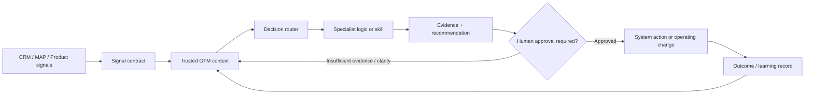

# AI GTM Operations

## What I mean by AI GTM Ops

AI GTM Ops is not a collection of prompts and it is not autonomous software making commercial decisions without controls.

I use the term for an operating model where trusted GTM signals and context, explicit decision rules, specialist automation and human accountability are connected in a version-controlled system.

The goal is simple: make Revenue and Marketing Operations faster without making the underlying logic less inspectable.

## The operating model

### 0. Signal layer

AI-assisted workflows need reliable operational signals before they need more intelligence.

In a real GTM architecture, signals may arrive through CRM and marketing-platform APIs, webhooks, product events, warehouse pipelines or other integration layers. Before downstream logic uses them, the business needs explicit answers to questions such as:

- Which source is authoritative for this event?
- What does the event mean commercially?
- Which entity does it belong to?
- Is the timestamp trustworthy?
- Is the event a replay or duplicate?
- Can the downstream workflow trace the signal back to its source?

The [GTM Signal Normalizer](tools/gtm-signal-normalizer/README.md) is a synthetic runnable demonstration of this layer. It converts fictional CRM, marketing-automation and product events into a small canonical contract while preserving provenance and rejecting unknown semantics.

### 1. Trusted context

The system needs authoritative definitions before it needs more intelligence.

Examples:

- Lifecycle and funnel definitions
- Qualification and routing rules
- Ownership and handoff standards
- SLA definitions
- Attribution and forecast definitions
- CRM / MAP field authority
- Campaign readiness and QA rules
- Named decision owners

If two teams disagree on the definition of an MQL, forecast stage or sourced pipeline, an agent should not quietly choose one.

### 2. Decision routing

A broad request is first classified into the operating decision that actually needs to be made.

Examples:

| Symptom | Likely operating route |
|---|---|
| “Pipeline is weak” | Pipeline quality, lifecycle conversion, source/influence or forecast evidence |
| “Leads are being ignored” | Routing, ownership, SLA or acceptance governance |
| “The dashboard is wrong” | Metric definition, data quality, source authority or reporting logic |
| “Campaigns take too long” | Intake, readiness, build, QA, capacity or handoff design |
| “We need an AI SDR workflow” | Evidence quality, segmentation, routing, action boundary and human-review design |

The router should preserve ambiguity rather than forcing every request into a confident answer.

### 3. Specialist logic

Each specialist should be narrow enough that its inputs, rules, failure modes and outputs can be inspected.

The portfolio currently demonstrates this approach through:

- [GTM Signal Normalizer](tools/gtm-signal-normalizer/README.md)
- [GTM Command Center](skills/command-center/README.md)
- [Pipeline Quality Scanner](tools/pipeline-quality-scanner/README.md)
- [Lifecycle Transition Validator](tools/lifecycle-validator/README.md)
- [GTM Ops Decision Router](tools/gtm-ops-router/README.md)

The point is not the number of agents. The point is whether the operating logic is explicit enough to test.

### 4. Evidence and decision contracts

A useful output separates:

- Observed facts
- Source provenance
- Assumptions
- Inferences
- Missing evidence
- Conflicting evidence
- Recommendation
- Required human decision
- Risks and limitations

That makes an AI-assisted recommendation reviewable by an operator rather than merely persuasive.

### 5. Human action boundary

Automation can prepare, validate, diagnose and recommend. Commercial accountability still needs an owner.

I would require explicit human approval before an AI-assisted workflow can materially change areas such as:

- Production CRM records at scale
- Customer or prospect treatment
- Lead or account ownership policy
- Spend
- Forecast definitions
- Executive metrics
- Staffing or territory decisions
- Compliance-sensitive treatment

The exact approval boundary depends on risk, reversibility and the quality of the evidence.

### 6. Outcome and learning record

A mature system should remember what was recommended, what decision was taken and what happened afterwards.

That does **not** mean allowing an agent to silently rewrite operating policy. Changes to definitions, signal mappings, routing logic, prompts or decision rules should be versioned and reviewable.

## Production experience vs portfolio proof

I keep these two evidence types separate.

### Production operating experience

My professional experience includes AI-assisted lead triage, scoring and routing work using tools including Dust.ai and Qualified, alongside broader lifecycle, CRM, martech, pipeline and reporting transformation.

At Contentsquare, AI-assisted routing and scoring contributed to a **40% reduction in SDR response lag** and **35% improvement in MQL-to-SDR velocity** within the wider operating redesign.

### Portfolio-built proof

This repository contains independently built, synthetic and testable demonstrations of the operating logic:

- A GTM signal normalizer modelling event contracts, provenance and deduplication
- A command-centre routing architecture
- A pipeline quality scanner
- A lifecycle transition validator
- A deterministic GTM Ops request router
- Unit tests and GitHub Actions for the runnable tools

These are portfolio demonstrations, not claims that the exact code ran inside a former employer environment.

## AI and build environment

My current working toolkit spans:

- Claude and Claude Code
- ChatGPT and OpenAI Codex
- GitHub
- Python for transparent diagnostic and integration-pattern tooling
- Lovable for rapid product prototyping
- Notion for structured operating documentation
- GTM AI / automation platforms including Dust.ai, Qualified and Clay

Tools will change. The durable layer is the signal and context design, decision logic, evidence standard and governance model.

## Where this creates value

### Revenue Operations

- Routing and ownership diagnostics
- Pipeline-quality checks
- Forecast-definition governance
- CRM data-quality triage
- Signal normalization across systems
- Manager pacing and exception analysis
- Repeatable request routing

### Marketing Operations

- Campaign readiness and QA
- Lifecycle-transition checks
- Lead-management governance
- Marketing-signal contracts
- Martech rationalisation inputs
- Data and consent controls
- Reporting definition validation

### GTM leadership

- Cross-functional metric reconciliation
- Decision briefs with explicit evidence
- Faster root-cause diagnosis
- Safer automation boundaries
- Version-controlled operating rules and event semantics

## Design principles

1. **Decision before tool.** Start with the commercial decision the system needs to improve.
2. **Signals need semantics.** Do not treat every raw event as decision-ready evidence.
3. **Context before automation.** An agent cannot rescue unresolved definitions or ownership.
4. **Narrow specialists over one giant prompt.** Smaller operating contracts are easier to test and govern.
5. **Live data stays live.** Fetch time-sensitive operational data from the authoritative system rather than copying it into a static knowledge base.
6. **Business logic should be portable.** Do not bury the operating model inside one vendor when the logic needs to survive tool changes.
7. **Evidence before confidence.** Missing or conflicting evidence should reduce automation, not increase rhetoric.
8. **Human accountability is designed, not assumed.** Every material action needs a named owner and an appropriate approval boundary.
9. **Learning must be reviewable.** Outcomes can improve future recommendations, but policy changes require versioned governance.

## What a reviewer can inspect next

- [GTM Signal Normalizer](tools/gtm-signal-normalizer/README.md) — event contracts, provenance and idempotency
- [GTM Command Center](skills/command-center/README.md) — orchestration and evidence architecture
- [GTM Ops Decision Router](tools/gtm-ops-router/README.md) — inspectable routing logic with tests
- [Pipeline Quality Scanner](tools/pipeline-quality-scanner/README.md) — data-quality rules affecting pipeline trust
- [Lifecycle Transition Validator](tools/lifecycle-validator/README.md) — explicit lifecycle governance in code
- [Revenue Operating System](frameworks/revenue-operating-system.md) — the wider operating model that AI sits inside
- [Confidentiality & Evidence Standard](CONFIDENTIALITY.md) — publication and evidence boundaries

---

**My view:** the future of GTM Operations is not “AI replaces Ops.” It is Ops becoming better at designing signals, context, decision systems, controls and automation that can be trusted.
