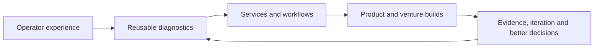

# Entrepreneur Journey

> **Evidence classification:** Founder and venture-building overview. Public or owned venture context only.

## Why I started building ventures

Most of my career has been spent fixing operating systems inside other companies. Over time, I kept seeing the same failures appear in different forms: unclear ownership, weak handoffs, fragmented tools, unreliable reporting and too much dependence on individual memory.

That repetition made me ask a different question: could some of the judgement behind the work become a product, service or venture rather than being rebuilt from scratch every time?

My venture journey is not a straight-line success story. It is a series of experiments in market need, trust, delivery, productisation and founder judgement.

## The biggest build so far

[ThinkBud](case-studies/ventures/building-thinkbud.md) is the most substantial venture build I have completed. You can also see the live product site at [www.thinkbud.co.uk](https://www.thinkbud.co.uk/).

I spent nearly eight months turning it from an idea into a working, invite-only learning-intelligence platform for UK 11+ preparation. It required me to work across product design, learning logic, content operations, data architecture, AI-assisted development, security, billing, testing and release management.

ThinkBud changed the nature of my founder journey. It moved me beyond propositions and service models into the reality of building and stabilising a software product where every decision affects parents, learners, data integrity and trust.

## The progression

## The ventures

| Venture | The question I explored | Portfolio treatment |
|---|---|---|
| **[ThinkBud](https://www.thinkbud.co.uk/)** | Can a parent-trusted, child-safe learning product use adaptive practice and learning data to make daily preparation more useful? | [Completed flagship venture case](case-studies/ventures/building-thinkbud.md) covering product, learning logic, architecture, security, AI-assisted development and controlled beta |
| **[LYNR](https://getlynr.com/)** | Can senior revenue execution be delivered through clear scope, one accountable lead and a clean handback? | [Completed retrospective](case-studies/ventures/building-lynr.md) covering the offer, delivery model and iteration |
| **NXClarity** | Can AI-assisted operating expertise become a useful proposition rather than another generic automation service? | Future retrospective focused on the market thesis, positioning, operating model and lessons |
| **Snugtot** | Can a consumer concept combine commercial discipline, responsible sourcing and a differentiated brand? | Future concept retrospective; forecasts remain assumptions |

## What building ThinkBud taught me

ThinkBud forced me to deal with the full weight of product decisions rather than only the attractiveness of the idea.

I had to:

- Decide what the product should do before choosing how to build it
- Define a reliable learning record and current learner state
- Connect content, skill taxonomy, adaptive selection and spaced review
- Protect answer integrity and parent/learner boundaries
- Design subscription and access rules
- Use AI-assisted development without giving up architecture and product ownership
- Build tests, release controls and documentation
- Freeze working parts of the system when further change created more risk than value
- Delay broad launch until the product had a safer operating baseline

## What the ventures have taught me more broadly

Across the ventures, I have had to:

- Turn an observed problem into a market thesis that can be tested
- Define the customer and the decision the proposition must help them make
- Design positioning, offers and commercial boundaries
- Translate strategy into a website, workflow, operating model or working product
- Treat privacy, trust and handback as part of the product
- Separate a genuine operating advantage from generic access to AI
- Narrow, change or stop when the evidence does not support the original idea
- Stay with difficult implementation work after the initial excitement has gone

## What I will not overclaim

The ventures are at different stages. I will not imply revenue, product-market fit, learning impact or investment readiness where the evidence does not exist.

The claim I am comfortable making is:

> I have taken ThinkBud from an idea to a working controlled-beta platform, built LYNR into a defined senior-execution model and repeatedly turned operating insight into structured propositions, workflows and products.

## What comes next

ThinkBud now needs evidence from a wider learner population, not more founder certainty. The next questions concern learning impact, signal quality, engagement, content scale and commercial viability.

The wider operator work remains the foundation, but ThinkBud is no longer a future footnote. It is the strongest example of what happens when I apply that operating discipline to a product from the ground up.

See [Building ThinkBud](case-studies/ventures/building-thinkbud.md), [Building Lynr](case-studies/ventures/building-lynr.md), [ThinkBud live](https://www.thinkbud.co.uk/), [LYNR live](https://getlynr.com/), [ROADMAP.md](ROADMAP.md) and [SOURCE-PROVENANCE.md](SOURCE-PROVENANCE.md).