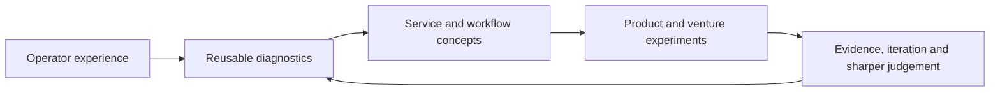

# Entrepreneur Journey

> **Evidence classification:** Founder and venture-building overview. Public or owned venture context only; no private financial, customer, source-code or production information is included.

## Why the journey matters

My career began inside operating systems built by other companies. Over time, the recurring pattern became clear: the same commercial failures appeared in different organisations because ownership, process, systems and data had not been designed as one system.

The entrepreneurial journey is an attempt to turn that accumulated operator experience into practical products, services and ventures. It is not presented as a straight-line success story. Each venture explored a different question about market need, trust, delivery, productisation and founder judgement.

## The progression

## Venture portfolio

| Venture | Core question explored | Portfolio treatment |
|---|---|---|
| **NXClarity** | Can AI-assisted operational expertise become a usable business proposition rather than a generic automation service? | Future retrospective focused on market thesis, positioning, operating model and lessons |
| **Snugtot** | Can a consumer concept combine commercial discipline, responsible sourcing and a differentiated brand? | Future concept retrospective; projections remain assumptions |
| **Lynr** | Can senior revenue execution be delivered as a clearly scoped, accountable and transferable operating model? | Future build case covering offer architecture, delivery governance and iteration |
| **ThinkBud** | Can a parent-trusted, child-safe learning product be built with strong product, content, security and commercial foundations? | High-level product-building case only; source code, production configuration and private data remain separate |

## What the ventures demonstrate

Across the ventures, the transferable work includes:

- Turning an observed problem into a testable market thesis
- Defining the customer and the decision the offer must help them make
- Designing positioning, offers and commercial boundaries
- Translating strategy into website, workflow, governance and execution
- Making privacy, trust and handback part of the product rather than an afterthought
- Distinguishing a genuine operating moat from generic AI capability
- Stopping, narrowing or changing direction when evidence does not support the original idea

## What remains unproven

The ventures are at different levels of maturity. This repository will not imply traction, revenue, product-market fit or investment readiness where those have not been evidenced.

The investor-relevant claim is narrower:

> I have repeatedly converted operating insight into structured propositions, workflows and product concepts, and I understand that the quality of the evidence matters more than the attractiveness of the pitch.

## Current sequencing

The operator portfolio comes first. Detailed venture retrospectives follow only after the core evidence demonstrates the professional judgement from which the ventures emerged.

See [ROADMAP.md](ROADMAP.md) and [SOURCE-PROVENANCE.md](SOURCE-PROVENANCE.md).
