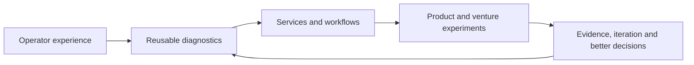

# Entrepreneur Journey

> **Evidence classification:** Founder and venture-building overview. Public or owned venture context only.

## Why I started building ventures

Most of my career has been spent fixing operating systems inside other companies. Over time, I kept seeing the same failures appear in different forms: unclear ownership, weak handoffs, fragmented tools, unreliable reporting and too much dependence on individual memory.

That repetition made me ask a different question: could some of the judgement behind the work become a product, service or venture rather than being rebuilt from scratch every time?

My venture journey is not a straight-line success story. It is a series of experiments in market need, trust, delivery, productisation and founder judgement.

## The progression

## The ventures

| Venture | The question I explored | Portfolio treatment |
|---|---|---|
| **NXClarity** | Can AI-assisted operating expertise become a useful proposition rather than another generic automation service? | Future retrospective focused on the market thesis, positioning, operating model and lessons |
| **Snugtot** | Can a consumer concept combine commercial discipline, responsible sourcing and a differentiated brand? | Future concept retrospective; forecasts remain assumptions |
| **Lynr** | Can senior revenue execution be delivered through clear scope, one accountable lead and a clean handback? | [Completed retrospective](case-studies/ventures/building-lynr.md) covering the offer, delivery model and iteration |
| **ThinkBud** | Can a parent-trusted, child-safe learning product be built with strong product, content, security and commercial foundations? | Future high-level product case; source code, production configuration and private data stay separate |

## What the ventures have taught me

Across the ventures, I have had to:

- Turn an observed problem into a market thesis that can be tested
- Define the customer and the decision the proposition must help them make
- Design positioning, offers and commercial boundaries
- Translate strategy into a website, workflow, operating model and delivery plan
- Treat privacy, trust and handback as part of the product
- Separate a genuine operating advantage from generic access to AI
- Narrow, change or stop when the evidence does not support the original idea

## What I will not overclaim

The ventures are at different stages. I will not imply revenue, traction, product-market fit or investment readiness where the evidence does not exist.

The claim I am comfortable making is narrower:

> I have repeatedly turned operating insight into structured propositions, workflows and product concepts. I have also learned that good positioning is not a substitute for evidence.

## What comes next

The operator work remains the foundation. Venture retrospectives are useful only when they show what I actually built, how the thinking changed and what is still unresolved.

See [Building Lynr](case-studies/ventures/building-lynr.md), [ROADMAP.md](ROADMAP.md) and [SOURCE-PROVENANCE.md](SOURCE-PROVENANCE.md).