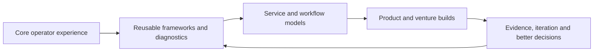

# Entrepreneur Journey

> **Evidence classification:** Founder and venture-building overview. Public or owned venture context only.

## How this connects to my career

My founder journey did not begin as a separate career track. It grew out of the operating work I had already been doing across Marketing Operations, Revenue Operations and GTM systems.

For years, I worked on problems involving unclear ownership, fragmented systems, unreliable data, weak handoffs and decisions that depended too heavily on individual memory. Over time, I started asking whether some of that judgement could become a product, a service or a more repeatable workflow.

That is the connection between my core career and the ventures. The context changes, but the underlying work is familiar: define the real problem, decide what should be authoritative, make the rules explicit, build the operating model and learn from evidence.

## ThinkBud

ThinkBud began as something I wanted to create for my own children.

At first, the aim was straightforward: build a more useful way for them to practise for the UK 11+. As I worked on it, the product took a different direction. The question became broader than creating practice material for my family. It became a learning-intelligence problem: how should a product decide what a learner should practise next, what they are likely to forget, how progress should be represented and how a parent can understand what is happening without turning the experience into surveillance?

Over nearly eight months, ThinkBud developed into a working, invite-only platform spanning product design, adaptive practice, spaced repetition, content operations, data architecture, AI-assisted development, security, billing, testing and controlled release.

The detailed case is in [Building ThinkBud](case-studies/ventures/building-thinkbud.md), and the live site is [www.thinkbud.co.uk](https://www.thinkbud.co.uk/).

## LYNR

LYNR grew directly from my professional experience in Revenue and GTM Operations.

The question was whether senior execution could sit between high-level advice and a permanent hire: diagnose the operating problem, define the outcome, build the system, document it and hand it back without creating unnecessary dependency.

The detailed retrospective is in [Building LYNR](case-studies/ventures/building-lynr.md), and the live site is [getlynr.com](https://getlynr.com/).

## The progression

## The ventures

| Venture | The question I explored | Portfolio treatment |
|---|---|---|
| **[ThinkBud](https://www.thinkbud.co.uk/)** | Can adaptive practice, structured content and learner history make daily preparation more useful and trustworthy? | [Completed product case](case-studies/ventures/building-thinkbud.md) |
| **[LYNR](https://getlynr.com/)** | Can senior revenue execution be delivered through clear scope, one accountable lead and a clean handback? | [Completed service-model retrospective](case-studies/ventures/building-lynr.md) |
| **NXClarity** | Can AI-assisted operating expertise become a useful proposition rather than another generic automation service? | Future retrospective |
| **Snugtot** | Can a consumer concept combine commercial discipline, responsible sourcing and a differentiated brand? | Future concept retrospective |

## What the ventures have taught me

Across the ventures, I have had to:

- Turn an observed problem into a testable proposition
- Define the user, customer and decision the product must support
- Translate strategy into a website, workflow, operating model or working product
- Make ownership, data authority and rules explicit
- Treat trust, privacy, security and handback as design inputs
- Use AI to extend execution without outsourcing judgement
- Narrow, change or stop when the evidence does not support the original idea
- Stay with difficult implementation work after the initial excitement has gone

## What I will not overclaim

The ventures are at different stages. I will not imply revenue, product-market fit, learning impact or investment readiness where the evidence does not exist.

The claim I am comfortable making is:

> I have taken the operating discipline developed through my career and applied it to a working learning product, a senior execution model and several venture experiments.

## What comes next

My Marketing Operations, Revenue Operations and GTM systems experience remains the foundation of the portfolio.

ThinkBud and LYNR add another dimension. They show that I can transfer that judgement into founder-led work, remain close to implementation and keep learning when the problem evolves beyond the original idea.