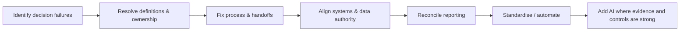

# GTM Operating Diagnostic

> **Evidence classification:** Original portfolio framework built from accumulated Marketing Operations, Revenue Operations and GTM systems experience.

A company can have strong people, good tools and plenty of activity while the revenue engine still feels unreliable.

The usual reason is that the operating model has developed gaps between **commercial definitions, ownership, process, systems, data, reporting and automation**.

This diagnostic is a fast way to identify where those gaps are.

## How to use it

Score each statement:

- **0 — Not true / unknown**
- **1 — Partly true / inconsistent**
- **2 — Mostly true / documented but not always followed**
- **3 — True, measurable and governed**

Do not average away a critical zero. A single unresolved definition or ownership gap can invalidate automation and reporting built on top of it.

---

## 1. Commercial definitions

| Question | Score 0–3 |
|---|---:|
| Marketing, Sales and Finance use the same definitions for lead, MQL, opportunity, pipeline and forecast | |
| Stage entry and exit criteria are explicit rather than inferred from individual behaviour | |
| Source, influence and progression are defined as different measurement concepts | |
| Conversion-rate denominators are agreed and documented | |
| Executive metrics have named owners and authoritative data sources | |

**Maximum: 15**

### Red flags

- Two dashboards show different pipeline numbers and both are considered “right”
- Teams debate definitions during QBRs instead of discussing performance
- AI-generated reports introduce metrics nobody previously agreed to use

---

## 2. Lifecycle, ownership and handoffs

| Question | Score 0–3 |
|---|---:|
| Every lifecycle transition has clear entry criteria and an accountable owner | |
| Routing rules are documented and exceptions are visible | |
| Marketing-to-Sales acceptance, rejection and recycling are measurable | |
| SLAs define both response time and what counts as a valid response | |
| Failed handoffs have an escalation and recovery path | |

**Maximum: 15**

### Red flags

- Leads disappear after assignment
- Rejection reasons are optional or meaningless
- Recycling exists as a status but not as an operating process
- Speed-to-lead is measured but acceptance quality is not

---

## 3. Systems and data authority

| Question | Score 0–3 |
|---|---:|
| Each critical business object or field has one authoritative system | |
| The same operating rule is not independently recreated across multiple tools | |
| Integrations have named owners and observable failure handling | |
| Required-field rules reflect business decisions rather than historical admin preferences | |
| Data-quality issues are measured by commercial impact, not only record completeness | |

**Maximum: 15**

### Red flags

- Nobody knows whether CRM, MAP, warehouse or spreadsheet is authoritative
- The same routing logic exists in three platforms
- A field is mandatory but nobody can explain which decision it supports

---

## 4. Pipeline, attribution and reporting truth

| Question | Score 0–3 |
|---|---:|
| Pipeline reporting can be reconciled from executive summary to underlying records | |
| Source, influence and forecast evidence are reported separately | |
| Opportunity-contact / buying-group coverage is sufficient for the attribution model being used | |
| Forecast changes can be explained through explicit stage, timing or value movements | |
| Leadership knows which metrics are decision-grade and which are directional | |

**Maximum: 15**

### Red flags

- Attribution model sophistication is higher than the quality of the underlying data
- Marketing and Sales use different opportunity populations
- Forecast accuracy is discussed without identifying the source of variance

---

## 5. Marketing / Revenue Operations operating model

| Question | Score 0–3 |
|---|---:|
| The Operations team has a clear service model, not just an intake queue | |
| Work is prioritised using commercial impact, risk and effort rather than stakeholder seniority | |
| Repetitive execution is standardised while senior judgement stays close to ambiguous decisions | |
| Platform ownership includes adoption, governance and business outcomes — not just administration | |
| The team can show where its work changed pipeline quality, speed, cost, risk or decision confidence | |

**Maximum: 15**

### Red flags

- The team's success metric is tickets closed
- Every request is treated as urgent
- Nobody owns whether a platform is creating commercial value after implementation

---

## 6. AI and automation readiness

| Question | Score 0–3 |
|---|---:|
| The decision being automated is explicitly defined | |
| AI workflows use named authoritative sources rather than generic context dumps | |
| Facts, assumptions and inferences are distinguishable in important outputs | |
| Material actions have explicit human approval or policy boundaries | |
| Prompt, context or decision-rule changes are versioned and reviewable | |

**Maximum: 15**

### Red flags

- “We need an agent” is the requirement
- The agent is expected to resolve a definition dispute that humans have not resolved
- New metrics appear in AI output without an agreed metric owner
- Nobody can say what the automation is allowed to change without approval

---

## 7. Governance, learning and change control

| Question | Score 0–3 |
|---|---:|
| Material operating definitions have named owners and review cadence | |
| Exceptions are visible rather than silently becoming the new process | |
| Recommendations and decisions can be connected to subsequent outcomes | |
| Changes to critical rules are documented and reversible | |
| Teams can distinguish a process problem, data problem, adoption problem and tooling problem before proposing a fix | |

**Maximum: 15**

### Red flags

- The organisation fixes the same issue every quarter
- Nobody knows when or why a routing or scoring rule changed
- A failed automation is treated as an AI problem when the input process was already broken

---

# Score interpretation

**Maximum score: 105**

| Score | Interpretation | Likely priority |
|---|---|---|
| **85–105** | Strong operating foundation | Optimise, automate and scale selectively |
| **65–84** | Functional but inconsistent | Resolve high-impact definition, ownership and system-authority gaps |
| **40–64** | Material operating friction | Stabilise lifecycle, data and reporting before adding more automation |
| **Below 40** | Operating model is likely driving revenue risk | Rebuild the commercial operating spine before major technology or AI investment |

The total score is only a directional signal. The more important output is **where the zeros and ones cluster**.

## The sequence I would use after the diagnostic

## What I would not do

I would not respond to a low AI-readiness score by buying an AI platform.

I would not respond to a reporting problem by immediately rebuilding the dashboard.

I would not respond to a routing problem by adding more rules before checking ownership and lifecycle definitions.

The diagnostic is designed to find the **operating dependency underneath the visible symptom**.

## Related portfolio evidence

- [Employer Brief](EMPLOYER-BRIEF.md)
- [Revenue Operating System](frameworks/revenue-operating-system.md)
- [Lifecycle Governance](frameworks/lifecycle-governance.md)
- [Pipeline Truth](frameworks/pipeline-truth.md)
- [Modern MOPS Operating Model](frameworks/mops-operating-model.md)
- [AI GTM Operations](AI-GTM-OPS.md)
- [GTM Ops Decision Router](tools/gtm-ops-router/README.md)

---

**Use the score to find where to look. Use operator judgement to decide what to change.**
