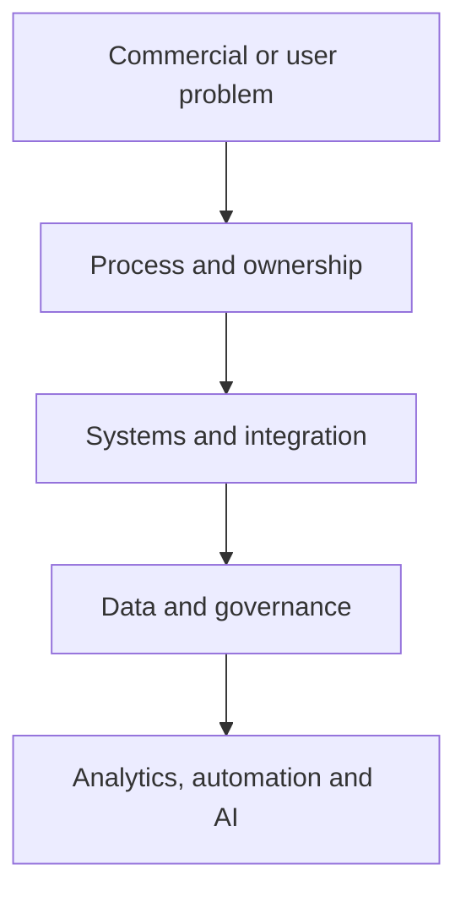

# Christopher Swarup — Revenue Systems, GTM Operations and Applied AI

**Marketing Operations · Revenue Operations · GTM systems · Applied AI · Product and venture building**

Thanks for taking a look.

I built this repository because a CV can tell you where I have worked, but it cannot really show you how I think through a difficult operating problem, the decisions I make, the trade-offs I consider or how far I can take the work into implementation.

The simplest way to describe what I do is this: I build operating systems. Most of my career has focused on B2B revenue and Marketing Operations. Over the last eight months, I have also taken ThinkBud from an idea to a working, invite-only learning-intelligence platform. That build is the clearest evidence here that I can move from a problem and a blank page into product, architecture, data, security, testing and release.

**Live websites:** [ThinkBud](https://www.thinkbud.co.uk/) · [LYNR](https://getlynr.com/)

## Start with the question you are trying to answer

| You are reviewing me as a… | Start here | What it should help you judge |
|---|---|---|
| **Potential employer** | [Employer Brief](EMPLOYER-BRIEF.md) → [Building ThinkBud](case-studies/ventures/building-thinkbud.md) → [Revenue Operating System case](case-studies/flagship/revenue-operating-system.md) | Can I take ownership of a complex problem and carry it from strategy into working implementation? |
| **CMO or Marketing leader** | [Campaign Operations case](case-studies/flagship/campaign-operations-os.md) → [MOPS operating model](frameworks/mops-operating-model.md) → [Pipeline case](case-studies/flagship/pipeline-truth-and-attribution.md) | Can I turn Marketing Operations into commercially accountable infrastructure? |
| **CRO, COO or Revenue leader** | [Operator Thesis](OPERATOR-THESIS.md) → [Revenue Operating System](frameworks/revenue-operating-system.md) → [Pipeline Truth](frameworks/pipeline-truth.md) | Can I create a revenue spine that teams can actually run and forecast from? |
| **Investor or adviser** | [Investor Brief](INVESTOR-BRIEF.md) → [Building ThinkBud](case-studies/ventures/building-thinkbud.md) → [Building Lynr](case-studies/ventures/building-lynr.md) | Can I turn operating experience into a product, service or venture and stay honest about what is proven? |
| **Technical or product reviewer** | [Building ThinkBud](case-studies/ventures/building-thinkbud.md) → [GTM Command Center](skills/command-center/README.md) → [Runnable tools](tools/README.md) | Can I make product, architecture, data, security and AI decisions that hold together? |

The longer review paths are in [REVIEWER-GUIDE.md](REVIEWER-GUIDE.md).

## The situations where I am most useful

I am usually brought into environments where the business has grown faster than the way it operates:

- Marketing and Sales no longer agree on what the numbers mean
- Lifecycle definitions differ by team, region or system
- Handoffs depend on individual judgement rather than agreed rules
- CRM and martech logic have become harder to explain than the process itself
- Campaign delivery is busy but difficult to prioritise, measure or improve
- Reporting exists, but leadership does not fully trust it
- AI or automation is being added before the operating foundation is ready
- A product idea needs someone to connect the user problem, operating model, data, technology and release path

My job is to make the important decisions explicit, put ownership around them, translate them into systems and data, and build a model that can continue after the initial change.

## The proof I would look at first

| Evidence | What you can inspect | Status |
|---|---|---|
| [Building ThinkBud](case-studies/ventures/building-thinkbud.md) · [Live site](https://www.thinkbud.co.uk/) | Nearly eight months of product, learning logic, AI-assisted development, data architecture, security, testing and founder execution | Controlled-beta build complete |
| [Revenue Operating System](case-studies/flagship/revenue-operating-system.md) | Cross-functional diagnosis, design, sequencing and governance | Complete |
| [Unified Lifecycle Governance](case-studies/flagship/unified-lifecycle-governance.md) | Definitions, ownership, handoffs, routing, recycling and adoption | Complete |
| [Campaign Operations OS](case-studies/flagship/campaign-operations-os.md) | Intake, readiness, build, QA, launch, follow-up and improvement | Complete |
| [Pipeline Truth and Attribution](case-studies/flagship/pipeline-truth-and-attribution.md) | Source, influence, progression, forecast evidence and reporting confidence | Complete |
| [Modern MOPS Team Operating Model](case-studies/leadership/modern-mops-team-operating-model.md) | Team design, service model, priorities, distributed delivery and adoption | Complete |
| [Operating frameworks](frameworks/README.md) | Five reusable models covering revenue, lifecycle, campaigns, pipeline and MOPS | Complete |
| [GTM Command Center](skills/command-center/README.md) | How I structure AI-assisted analysis without removing human accountability | Reconstructed architecture |
| [Runnable tools](tools/README.md) | Two small synthetic tools with explicit rules and unit tests | Complete |
| [Building Lynr](case-studies/ventures/building-lynr.md) · [Live site](https://getlynr.com/) | How I turned operator experience into a scoped service and delivery model | Complete retrospective |

## The principle behind the work

> Build the operating foundation first. Add automation and AI only when the underlying decisions, ownership and data can be trusted.

The order matters. AI does not fix unclear ownership, contested definitions or poor data. It simply produces faster output from a weak foundation. ThinkBud forced me to apply that principle outside RevOps, where the consequences involved learner trust, answer integrity, parent controls and product safety.

## Case studies

- [Building ThinkBud](case-studies/ventures/building-thinkbud.md) · [Visit ThinkBud](https://www.thinkbud.co.uk/)
- [Revenue Operating System](case-studies/flagship/revenue-operating-system.md)
- [Unified Lifecycle Governance](case-studies/flagship/unified-lifecycle-governance.md)
- [Campaign Operations OS](case-studies/flagship/campaign-operations-os.md)
- [Pipeline Truth and Attribution](case-studies/flagship/pipeline-truth-and-attribution.md)
- [Modern MOPS Team Operating Model](case-studies/leadership/modern-mops-team-operating-model.md)
- [Building Lynr](case-studies/ventures/building-lynr.md) · [Visit LYNR](https://getlynr.com/)

## Frameworks

- [Revenue Operating System](frameworks/revenue-operating-system.md)
- [Lifecycle Governance](frameworks/lifecycle-governance.md)
- [Campaign Operations](frameworks/campaign-operations.md)
- [Pipeline Truth](frameworks/pipeline-truth.md)
- [Modern MOPS Operating Model](frameworks/mops-operating-model.md)

## AI, product and runnable proof

I do not treat AI as a separate layer of theatre. I use it where the decision, evidence and accountable owner are clear.

- [Building ThinkBud](case-studies/ventures/building-thinkbud.md)
- [Skills and Systems](SKILLS-AND-SYSTEMS.md)
- [Skills Library](skills/README.md)
- [GTM Command Center](skills/command-center/README.md)
- [CRM Data Quality Auditor — draft specification](skills/crm-data-quality-auditor/README.md)
- [Pipeline Quality Scanner](tools/pipeline-quality-scanner/README.md)
- [Lifecycle Transition Validator](tools/lifecycle-validator/README.md)

ThinkBud is the strongest example of how I use AI in practice: not just to generate ideas, but to help me develop, debug, document and test a real product while I retained responsibility for the product and architecture decisions.

## A final note on evidence

I have deliberately avoided filling this repository with unsupported metrics or polished claims that cannot be checked. Where something is reconstructed, synthetic, still being tested or not yet verified, I say so.

Public employer names, role titles and dates appear only in [PROFILE.md](PROFILE.md). The operating work is company-neutral and rebuilt from scratch. The ThinkBud case uses only portfolio-safe information from a venture I own; its source code, configuration and learner data remain in the separate private product repository.

The controls are documented in:

- [Voice and Style Standard](VOICE-AND-STYLE.md)
- [Confidentiality Policy](CONFIDENTIALITY.md)
- [Security Policy](SECURITY.md)
- [Source Provenance](SOURCE-PROVENANCE.md)
- [Review Checklist](REVIEW-CHECKLIST.md)
- [Controlled Release QA](RELEASE-QA.md)

---

**Private portfolio · Controlled reviewer access · Not for redistribution**