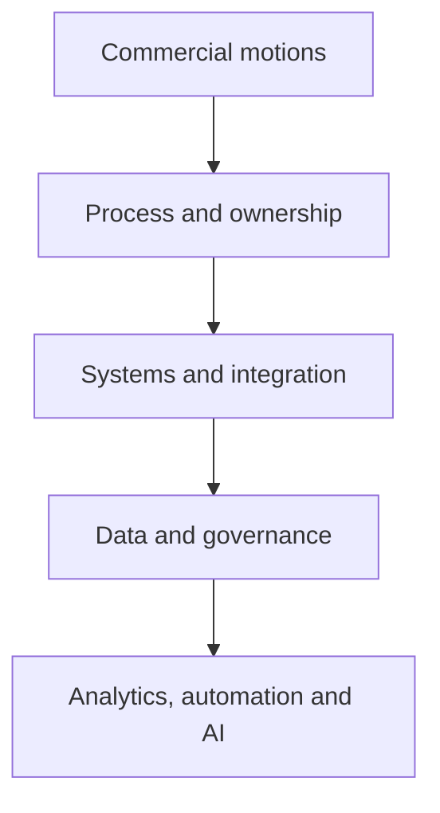

# Christopher Swarup — Revenue Systems, GTM Operations and Applied AI

**Marketing Operations · Revenue Operations · GTM systems · Applied AI · Venture building**

Thanks for taking a look.

I built this repository because a CV can tell you where I have worked, but it cannot really show you how I think through a difficult operating problem, the decisions I make, the trade-offs I consider or how far I can take the work into implementation.

The simplest way to describe what I do is this: I help B2B organisations make their revenue operations more understandable, more dependable and easier to run. That usually means connecting commercial strategy, ownership, process, platforms, data and reporting so teams are no longer working from different versions of the truth.

## Start with the question you are trying to answer

| You are reviewing me as a… | Start here | What it should help you judge |
|---|---|---|
| **Potential employer** | [Employer Brief](EMPLOYER-BRIEF.md) → [Professional Profile](PROFILE.md) → [Revenue Operating System case](case-studies/flagship/revenue-operating-system.md) | Can I diagnose, design and lead complex GTM operating change? |
| **CMO or Marketing leader** | [Campaign Operations case](case-studies/flagship/campaign-operations-os.md) → [MOPS operating model](frameworks/mops-operating-model.md) → [Pipeline case](case-studies/flagship/pipeline-truth-and-attribution.md) | Can I turn Marketing Operations into commercially accountable infrastructure? |
| **CRO, COO or Revenue leader** | [Operator Thesis](OPERATOR-THESIS.md) → [Revenue Operating System](frameworks/revenue-operating-system.md) → [Pipeline Truth](frameworks/pipeline-truth.md) | Can I create a revenue spine that teams can actually run and forecast from? |
| **Investor or adviser** | [Investor Brief](INVESTOR-BRIEF.md) → [Building Lynr](case-studies/ventures/building-lynr.md) → [GTM Command Center](skills/command-center/README.md) | Can my operating experience become repeatable services, tools or products? |
| **Technical or operations reviewer** | [Skills Library](skills/README.md) → [Lifecycle validator](tools/lifecycle-validator/README.md) → [Pipeline scanner](tools/pipeline-quality-scanner/README.md) | Is the logic clear, testable and governed? |

The longer review paths are in [REVIEWER-GUIDE.md](REVIEWER-GUIDE.md).

## The situations where I am most useful

I am usually brought into environments where the business has grown faster than the way it operates:

- Marketing and Sales no longer agree on what the numbers mean
- Lifecycle definitions differ by team, region or system
- Handoffs depend on individual judgement rather than agreed rules
- CRM and martech logic have become harder to explain than the process itself
- Campaign delivery is busy but difficult to prioritise, measure or improve
- Reporting exists, but leadership does not fully trust it
- AI or automation is being added before the operating foundation is ready

My job is to make the important decisions explicit, put ownership around them, translate them into systems and data, and build a governance model that can continue after the initial change.

## The proof I would look at first

| Evidence | What you can inspect | Status |
|---|---|---|
| [Revenue Operating System](case-studies/flagship/revenue-operating-system.md) | Cross-functional diagnosis, design, sequencing and governance | Complete |
| [Unified Lifecycle Governance](case-studies/flagship/unified-lifecycle-governance.md) | Definitions, ownership, handoffs, routing, recycling and adoption | Complete |
| [Campaign Operations OS](case-studies/flagship/campaign-operations-os.md) | Intake, readiness, build, QA, launch, follow-up and improvement | Complete |
| [Pipeline Truth and Attribution](case-studies/flagship/pipeline-truth-and-attribution.md) | Source, influence, progression, forecast evidence and reporting confidence | Complete |
| [Modern MOPS Team Operating Model](case-studies/leadership/modern-mops-team-operating-model.md) | Team design, service model, priorities, distributed delivery and adoption | Complete |
| [Operating frameworks](frameworks/README.md) | Five reusable models covering revenue, lifecycle, campaigns, pipeline and MOPS | Complete |
| [GTM Command Center](skills/command-center/README.md) | How I structure AI-assisted analysis without removing human accountability | Reconstructed architecture |
| [Runnable tools](tools/README.md) | Two small synthetic tools with explicit rules and unit tests | Complete |
| [Building Lynr](case-studies/ventures/building-lynr.md) | How I turned operator experience into a scoped service and delivery model | Complete retrospective |

## The principle behind the work

> Build the operating foundation first. Add automation and AI only when the underlying decisions, ownership and data can be trusted.

The order matters. AI does not fix unclear ownership, contested definitions or poor data. It simply produces faster output from a weak foundation.

## Case studies

- [Revenue Operating System](case-studies/flagship/revenue-operating-system.md)
- [Unified Lifecycle Governance](case-studies/flagship/unified-lifecycle-governance.md)
- [Campaign Operations OS](case-studies/flagship/campaign-operations-os.md)
- [Pipeline Truth and Attribution](case-studies/flagship/pipeline-truth-and-attribution.md)
- [Modern MOPS Team Operating Model](case-studies/leadership/modern-mops-team-operating-model.md)
- [Building Lynr](case-studies/ventures/building-lynr.md)

## Frameworks

- [Revenue Operating System](frameworks/revenue-operating-system.md)
- [Lifecycle Governance](frameworks/lifecycle-governance.md)
- [Campaign Operations](frameworks/campaign-operations.md)
- [Pipeline Truth](frameworks/pipeline-truth.md)
- [Modern MOPS Operating Model](frameworks/mops-operating-model.md)

## AI, skills and runnable proof

I do not treat AI as a separate layer of theatre. I use it where the decision, evidence and accountable owner are clear.

- [Skills and Systems](SKILLS-AND-SYSTEMS.md)
- [Skills Library](skills/README.md)
- [GTM Command Center](skills/command-center/README.md)
- [CRM Data Quality Auditor — draft specification](skills/crm-data-quality-auditor/README.md)
- [Pipeline Quality Scanner](tools/pipeline-quality-scanner/README.md)
- [Lifecycle Transition Validator](tools/lifecycle-validator/README.md)

The two runnable tools use fictional data and explicit rules. They do not connect to production systems or make business decisions automatically.

## A final note on evidence

I have deliberately avoided filling this repository with unsupported metrics or polished claims that cannot be checked. Where something is reconstructed, synthetic, still being tested or not yet verified, I say so.

Public employer names, role titles and dates appear only in [PROFILE.md](PROFILE.md). The operating work is company-neutral and rebuilt from scratch.

This repository does not contain real customer or employee data, production exports, internal screenshots, copied employer documents, private system designs, confidential metrics, credentials or personal information.

The controls are documented in:

- [Voice and Style Standard](VOICE-AND-STYLE.md)
- [Confidentiality Policy](CONFIDENTIALITY.md)
- [Security Policy](SECURITY.md)
- [Source Provenance](SOURCE-PROVENANCE.md)
- [Review Checklist](REVIEW-CHECKLIST.md)
- [Controlled Release QA](RELEASE-QA-2026-07-18.md)

---

**Private portfolio · Controlled reviewer access · Not for redistribution**