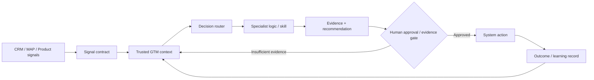

# Christopher Swarup — Revenue Systems, Marketing Operations, RevOps & AI GTM Operations

**Senior GTM operator · RevOps / MOPS / GTM Systems / AI GTM Engineering · 15+ years · London, UK · Available immediately**

I build the operating infrastructure behind B2B revenue — the lifecycle rules, systems, data, reporting, governance and AI-assisted workflows that let Marketing, Sales and Revenue leadership operate from the same commercial truth.

My most recent role was **Head of Global Marketing Operations at DevRev (Jan–Jun 2026)**. Before that I led global Marketing Operations, Revenue Systems and GTM transformation work across Contentsquare, Pleo, Nutanix, Equinix, FE fundinfo and Finastra.

## 30-second proof

| Scale / outcome | Evidence |
|---|---|
| **100 → 50 tools** | Contentsquare martech rationalisation: **–18% cost, +30% execution speed** |
| **+30% forecast accuracy** | Unified Snowflake + Tableau revenue reporting layer at Contentsquare |
| **–40% SDR response lag** | AI-assisted routing / scoring work using Dust.ai and Qualified |
| **+35% MQL → SQL** | Pleo lead-to-deal operating model |
| **+156% MQL** | Nutanix multi-touch lead-engine transformation across **14 EMEA countries** |
| **$18M annual budget** | Nutanix EMEA marketing scope |
| **Global MOPS scale** | Contentsquare COE supporting **120+ marketers** with 4 direct reports |
| **2 direct + 8 matrix** | Equinix global operating model with a **$1.6M systems budget** |

Full chronology and context: [Professional Profile](PROFILE.md).

## Where I compete

I am strongest where a role needs more than platform administration or reporting production.

- **Head / Senior Director / VP Marketing Operations** — operating model, martech, lifecycle, analytics, team design and governance
- **Head / Director Revenue Operations** — funnel definitions, pipeline governance, CRM operating model, attribution, forecasting and handoffs
- **GTM Operations / Commercial Operations** — cross-functional operating spine connecting Marketing, Sales, Product and Finance
- **Revenue Systems / Marketing Technology** — architecture, migrations, rationalisation, system authority and data quality
- **AI GTM Operations / GTM Engineering / GTM Systems** — signal and context design, decision routing, specialist automation, evidence contracts, human approval and version-controlled operating logic

## Why this portfolio is different

A senior operator should be able to move across four levels without losing the thread:

1. **Commercial decision** — what outcome or decision actually needs to improve?
2. **Operating model** — who owns what, what are the definitions, handoffs and controls?
3. **Systems and data** — how is that model represented in CRM, MAP, BI and integrations?
4. **Automation and AI** — which parts can be accelerated safely, and where must a human remain accountable?

This portfolio shows all four: career outcomes, reconstructed operating case studies, reusable frameworks, AI/GTM architecture and runnable tools with tests.

**Want something practical rather than another bio?** Use the [GTM Operating Diagnostic](GTM-OPERATING-DIAGNOSTIC.md) — a 105-point assessment across commercial definitions, lifecycle, systems, pipeline truth, Ops maturity, AI readiness and governance.

## Start here

| You are reviewing me as a… | Recommended route | What it should help you judge |
|---|---|---|
| **Recruiter / potential employer** | [Employer Brief](EMPLOYER-BRIEF.md) → [Professional Profile](PROFILE.md) → [Revenue Operating System case](case-studies/flagship/revenue-operating-system.md) | Level, scope, leadership and commercial impact |
| **CMO / Marketing leader** | [Campaign Operations](case-studies/flagship/campaign-operations-os.md) → [MOPS Operating Model](frameworks/mops-operating-model.md) → [Pipeline Truth](case-studies/flagship/pipeline-truth-and-attribution.md) | Can I turn MOPS into commercially accountable infrastructure? |
| **CRO / COO / Revenue leader** | [Operator Thesis](OPERATOR-THESIS.md) → [Revenue Operating System](frameworks/revenue-operating-system.md) → [Pipeline Truth](frameworks/pipeline-truth.md) | Can I create one operating spine across the revenue engine? |
| **AI / GTM Engineering reviewer** | [AI GTM Operations](AI-GTM-OPS.md) → [GTM Signal Normalizer](tools/gtm-signal-normalizer/README.md) → [GTM Command Center](skills/command-center/README.md) → [GTM Ops Router](tools/gtm-ops-router/README.md) → [Runnable Tools](tools/README.md) | Can I connect GTM signals, context and decision logic into something explicit, testable and safe to automate? |
| **Investor / adviser** | [Investor Brief](INVESTOR-BRIEF.md) → [Entrepreneur Journey](ENTREPRENEUR-JOURNEY.md) | Can operator judgement become repeatable products, tools or services? |

## AI GTM Operations

My view of AI GTM Ops is not “add a chatbot to RevOps.” It is a controlled operating system where trusted signals and context, explicit decision logic, specialist automation and human accountability work together.

### What I can show here

- [AI GTM Operations](AI-GTM-OPS.md) — my full operating model for signals, context, routing, evidence, control and learning
- [GTM Signal Normalizer](tools/gtm-signal-normalizer/README.md) — synthetic CRM / MAP / product event contracts, provenance, deduplication and integration logic
- [GTM Command Center](skills/command-center/README.md) — portfolio-safe orchestration architecture
- [GTM Ops Decision Router](tools/gtm-ops-router/README.md) — deterministic coordination logic with evidence gates and tests
- [Pipeline Quality Scanner](tools/pipeline-quality-scanner/README.md) — explicit pipeline data-quality checks
- [Lifecycle Transition Validator](tools/lifecycle-validator/README.md) — lifecycle governance expressed as executable rules

The portfolio code is deliberately synthetic and transparent. It demonstrates how I translate GTM operating logic into something technical teams and AI systems can inspect — without claiming employer production code.

## Core operator proof

| Evidence | What you can inspect |
|---|---|
| [GTM Operating Diagnostic](GTM-OPERATING-DIAGNOSTIC.md) | A practical 105-point diagnostic across commercial definitions, handoffs, systems, reporting, Ops maturity, AI readiness and governance |
| [Revenue Operating System](case-studies/flagship/revenue-operating-system.md) | Cross-functional diagnosis, operating design, sequencing and governance |
| [Unified Lifecycle Governance](case-studies/flagship/unified-lifecycle-governance.md) | Definitions, qualification, routing, handoffs, recycling and adoption |
| [Pipeline Truth & Attribution](case-studies/flagship/pipeline-truth-and-attribution.md) | Source, influence, progression, forecast evidence and reporting confidence |
| [Campaign Operations OS](case-studies/flagship/campaign-operations-os.md) | Intake, readiness, build, QA, launch, follow-up and improvement |
| [Modern MOPS Team Operating Model](case-studies/leadership/modern-mops-team-operating-model.md) | Team design, service model, priorities and distributed delivery |
| [Operating Frameworks](frameworks/README.md) | Reusable operating models across revenue, lifecycle, pipeline and MOPS |
| [Runnable Proof](tools/README.md) | Python demonstrations covering signal contracts, routing, pipeline quality and lifecycle controls with explicit rules, synthetic data and unit tests |

## Technology and AI working environment

**CRM / MAP / GTM systems:** Salesforce · Marketo · HubSpot · Iterable · Chili Piper · LeanData · Segment · Hightouch · SalesLoft · Outreach

**Data / analytics:** Snowflake · Tableau · Google Analytics

**AI / enrichment / automation:** Dust.ai · Qualified · Clay · Clearbit · HG Insights

**Current AI / build toolkit:** Claude · Claude Code · ChatGPT · OpenAI Codex · GitHub · Python · Lovable · Notion

**Portfolio-built technical proof:** JSON contracts · event / webhook architecture patterns · deterministic routing · source provenance · idempotency · unit tests · CI

The tool list matters less than the operating principle: **do not automate contested definitions, broken ownership or unreliable data.**

## Leadership and operating scale

- **Contentsquare:** 4 direct reports including one Director-level report; ~$1.8M MOPS / technology budget; Global MOPS COE supporting 120+ marketers across EMEA, AMER and APAC
- **Pleo:** 3 direct reports; ~$1.3M operations / technology budget
- **Nutanix:** 4 direct reports; $18M annual EMEA marketing budget across 14 countries
- **Equinix:** 2 direct + 8 matrix reports; $1.6M systems budget

## The principle behind the work

> **Build the operating foundation first. Add automation and AI only when the underlying decisions, ownership and data can be trusted.**

Commercial problem → ownership & process → systems → data & governance → analytics → automation & AI

## Independent builds

I also apply the same operating discipline to independent products and ventures. These are **not employers and are separate from my employment chronology**.

- [Building ThinkBud](case-studies/ventures/building-thinkbud.md) · [Live product](https://www.thinkbud.co.uk/)
- [Building LYNR](case-studies/ventures/building-lynr.md) · [Live site](https://getlynr.com/)
- [Entrepreneur Journey](ENTREPRENEUR-JOURNEY.md)

## Evidence and confidentiality

This is a public professional portfolio, not an archive of employer material. Employer-related case studies are independently reconstructed, company-neutral and free from production data or employer-owned source artefacts. Synthetic, reconstructed and conceptual work is labelled explicitly.

See [Confidentiality & Evidence Standard](CONFIDENTIALITY.md) and [Security](SECURITY.md).

## Connect

**LinkedIn:** [linkedin.com/in/christopherswarup](https://www.linkedin.com/in/christopherswarup)

---

**Public professional portfolio · Revenue systems, GTM operating models and AI-assisted operations that can survive contact with a real business.**
