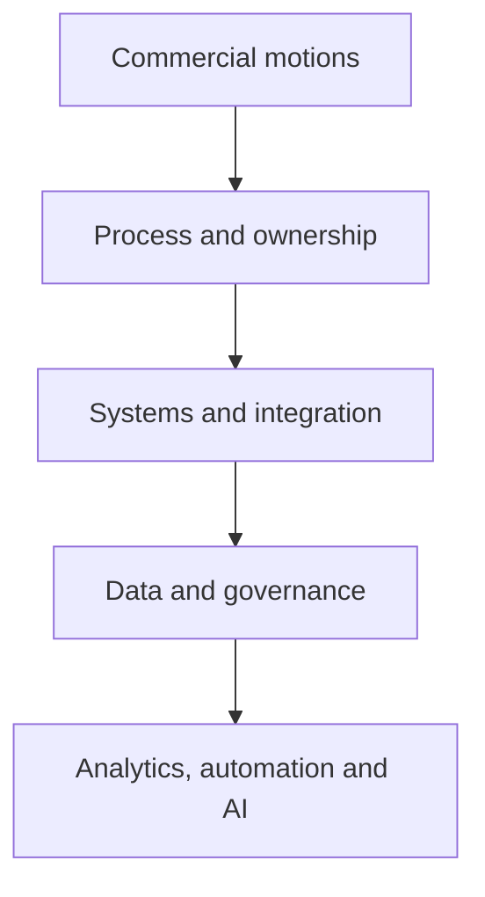

# Christopher Swarup — GTM Operating Systems and AI-Enabled Operations

**Marketing Operations · Revenue Operations · GTM transformation · AI-assisted decision systems · Operator-to-founder execution**

I design and build the operating systems behind predictable B2B revenue—connecting commercial strategy, process, ownership, platforms, data, analytics and AI so teams can execute with clarity.

This private repository is a professional evidence room for employers, investors and advisers. It shows how I diagnose operating problems, design systems, lead change and convert experience into reusable frameworks and tools.

## Start here

| Reviewer | Recommended ten-minute path | Decision supported |
|---|---|---|
| **Potential employer** | [Professional Profile](PROFILE.md) → [Revenue Operating System case](case-studies/flagship/revenue-operating-system.md) → [Leadership case](case-studies/leadership/modern-mops-team-operating-model.md) | Can Christopher diagnose, design and lead complex GTM operating change? |
| **CMO / Marketing leader** | [MOPS operating model](frameworks/mops-operating-model.md) → [Lifecycle case](case-studies/flagship/unified-lifecycle-governance.md) → [Pipeline case](case-studies/flagship/pipeline-truth-and-attribution.md) | Can he turn Marketing Operations into commercially accountable infrastructure? |
| **CRO / COO / Revenue leader** | [Operator Thesis](OPERATOR-THESIS.md) → [Revenue Operating System framework](frameworks/revenue-operating-system.md) → [Pipeline Truth](frameworks/pipeline-truth.md) | Can he create a revenue spine teams can run and forecast from? |
| **Investor / adviser** | [Entrepreneur Journey](ENTREPRENEUR-JOURNEY.md) → [Building Lynr](case-studies/ventures/building-lynr.md) → [GTM Command Center](skills/command-center/README.md) | Is the expertise repeatable, productisable and commercially valuable? |
| **Technical / operations reviewer** | [Skills Library](skills/README.md) → [Lifecycle validator](tools/lifecycle-validator/README.md) → [Pipeline scanner](tools/pipeline-quality-scanner/README.md) | Is the logic inspectable, governed and grounded in operational reality? |

Full review guidance is in [REVIEWER-GUIDE.md](REVIEWER-GUIDE.md).

## Proof at a glance

| Evidence | What it demonstrates | Status |
|---|---|---|
| [Revenue Operating System case](case-studies/flagship/revenue-operating-system.md) | Cross-functional diagnosis, design, implementation and governance | Complete |
| [Unified Lifecycle Governance case](case-studies/flagship/unified-lifecycle-governance.md) | Lifecycle, ownership, handoffs, routing, recycling and adoption | Complete |
| [Pipeline Truth and Attribution case](case-studies/flagship/pipeline-truth-and-attribution.md) | Source, influence, progression, forecast evidence and reporting credibility | Complete |
| [Modern MOPS leadership case](case-studies/leadership/modern-mops-team-operating-model.md) | Team design, service model, portfolio management and distributed delivery | Complete |
| [Operating frameworks](frameworks/README.md) | Reusable Revenue, lifecycle, pipeline and MOPS operating models | Four complete |
| [GTM Command Center](skills/command-center/README.md) | AI-assisted orchestration, evidence standards and human accountability | Architecture reconstructed |
| [Runnable tools](tools/README.md) | Inspectable operating logic using synthetic data and unit tests | Two complete |
| [Building Lynr](case-studies/ventures/building-lynr.md) | Market thesis, offer architecture, delivery governance and founder iteration | Complete retrospective |
| [Entrepreneur Journey](ENTREPRENEUR-JOURNEY.md) | Progression from operator experience to ventures and productisation | Complete overview |

## What this portfolio demonstrates

- Diagnosing the operating cause beneath visible GTM symptoms
- Translating strategy into definitions, ownership, process, systems and data
- Connecting Marketing, Sales, SDR, Partnerships, Customer Success, Finance, Data and Technology
- Designing lifecycle, campaign, platform and data governance that survives beyond one person or tool
- Building trusted pipeline, attribution, forecasting and executive decision systems
- Leading Marketing and Revenue Operations through implementation, enablement and adoption
- Structuring AI as governed decision support rather than an unaccountable shortcut
- Converting operating knowledge into frameworks, diagnostics, services and venture concepts

## Core operating system

The dependency runs downward. Automation and AI become valuable only when ownership, definitions and data are trustworthy.

## Evidence library

### Case studies

- [Case-study index](case-studies/README.md)
- [Revenue Operating System](case-studies/flagship/revenue-operating-system.md)
- [Unified Lifecycle Governance](case-studies/flagship/unified-lifecycle-governance.md)
- [Pipeline Truth and Attribution](case-studies/flagship/pipeline-truth-and-attribution.md)
- [Modern MOPS Team Operating Model](case-studies/leadership/modern-mops-team-operating-model.md)
- [Building Lynr](case-studies/ventures/building-lynr.md)

### Frameworks

- [Revenue Operating System](frameworks/revenue-operating-system.md)
- [Lifecycle Governance](frameworks/lifecycle-governance.md)
- [Pipeline Truth](frameworks/pipeline-truth.md)
- [Modern MOPS Operating Model](frameworks/mops-operating-model.md)

### AI and reusable skills

- [Skills and Systems](SKILLS-AND-SYSTEMS.md)
- [Skills Library](skills/README.md)
- [GTM Command Center](skills/command-center/README.md)
- [CRM Data Quality Auditor draft](skills/crm-data-quality-auditor/README.md)

### Runnable proof

- [Pipeline Quality Scanner](tools/pipeline-quality-scanner/README.md)
- [Lifecycle Transition Validator](tools/lifecycle-validator/README.md)

Both tools use fictional data, explicit rules, JSON output and unit tests. They do not access production systems or automate business decisions.

## Professional and founder context

- [Professional Profile](PROFILE.md)
- [Operator Thesis](OPERATOR-THESIS.md)
- [Entrepreneur Journey](ENTREPRENEUR-JOURNEY.md)

The public career timeline names employers, roles and dates. Operating evidence remains company-neutral.

## Evidence discipline

Major artefacts carry an explicit label:

- **Composite implemented experience — independently reconstructed**
- **Original portfolio framework**
- **Portfolio-safe skill specification**
- **Synthetic demonstration**
- **Independent strategic exercise**
- **Venture retrospective**
- **Concept under development**

Quantified outcomes are not asserted unless their definition, source, period, contribution and disclosure basis are verified. See the [Claim Register](evidence/claim-register.md).

## Privacy and company boundary

> Rebuild the insight. Never migrate the source file.

Public employer names, role titles and dates appear only in [PROFILE.md](PROFILE.md). Case studies, frameworks, skills and tools contain no real company or customer data.

This repository does not contain:

- Personal email addresses, phone numbers, home addresses, precise location or family information
- Customer, prospect, employee, partner, supplier, parent, child or user data
- Production records, CRM exports, usage data or real identifiers
- Internal company metrics, budgets, programme names, customer volumes or incidents
- Internal screenshots, dashboards, private links or system architecture
- Copied employer documents, proprietary prompts, private schemas or exact configurations
- Credentials, recovery codes, API keys, tokens or environment files

Examples use fictional organisations, fictional people and synthetic records.

## Governance and diligence

- [Reviewer Guide](REVIEWER-GUIDE.md)
- [Portfolio Standards](PORTFOLIO-STANDARDS.md)
- [Source Provenance](SOURCE-PROVENANCE.md)
- [Exclusion Register](EXCLUSION-REGISTER.md)
- [Review Checklist](REVIEW-CHECKLIST.md)
- [Confidentiality Policy](CONFIDENTIALITY.md)
- [Security Policy](SECURITY.md)
- [Drive Evidence Audit](DRIVE-EVIDENCE-AUDIT.md)

## Current build status

### Complete

- Professional profile, operator thesis and employer/investor navigation
- Drive evidence audit and 26-workstream capability map
- Three flagship operator cases and one leadership case
- Four reusable operating frameworks
- GTM Command Center architecture
- Two runnable synthetic diagnostics with tests
- Entrepreneur journey overview and one venture retrospective
- Privacy, confidentiality, provenance and claim controls

### Next evidence wave

- Campaign Operations OS case study
- Verification of historical specialist-skill artefacts
- Additional synthetic skill demonstrations
- External reviewer feedback and navigation refinement

## Core principle

> Build the operating foundation first. Add automation and AI only when the underlying decisions, ownership and data can be trusted.

---

**Private portfolio · Controlled reviewer access · Not for redistribution**
