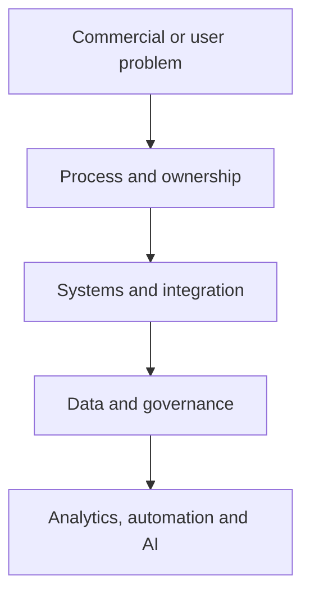

# Christopher Swarup — Revenue Systems, GTM Operations and Applied AI

**Marketing Operations · Revenue Operations · GTM systems · Transformation · Applied AI · Product and venture building**

Thanks for taking a look.

My core career has been spent building and improving the operating systems behind B2B revenue. For more than 15 years, I have worked across Marketing Operations, Revenue Operations, GTM systems, martech, data, analytics, team design and cross-functional transformation.

This repository shows how I approach that work: how I diagnose the real operating problem, make ownership and definitions explicit, connect process to systems and data, and take the work far enough into implementation for people to use it.

Alongside my career, I have also built products and ventures. ThinkBud began as something I wanted to create for my own children and gradually developed into a broader learning-intelligence platform. LYNR applies the same operating discipline to a senior revenue-execution model. They are part of the same professional story: evidence that I can transfer my core skills into new products, services and operating environments.

**Live ventures:** [ThinkBud](https://www.thinkbud.co.uk/) · [LYNR](https://getlynr.com/)

## Start with the question you are trying to answer

| You are reviewing me as a… | Start here | What it should help you judge |
|---|---|---|
| **Potential employer** | [Employer Brief](EMPLOYER-BRIEF.md) → [Professional Profile](PROFILE.md) → [Revenue Operating System case](case-studies/flagship/revenue-operating-system.md) | Can I diagnose, design and lead complex GTM operating change? |
| **CMO or Marketing leader** | [Campaign Operations case](case-studies/flagship/campaign-operations-os.md) → [MOPS operating model](frameworks/mops-operating-model.md) → [Pipeline case](case-studies/flagship/pipeline-truth-and-attribution.md) | Can I turn Marketing Operations into commercially accountable infrastructure? |
| **CRO, COO or Revenue leader** | [Operator Thesis](OPERATOR-THESIS.md) → [Revenue Operating System](frameworks/revenue-operating-system.md) → [Pipeline Truth](frameworks/pipeline-truth.md) | Can I create a revenue spine that teams can actually run and forecast from? |
| **Investor or adviser** | [Investor Brief](INVESTOR-BRIEF.md) → [Entrepreneur Journey](ENTREPRENEUR-JOURNEY.md) → [ThinkBud](case-studies/ventures/building-thinkbud.md) and [LYNR](case-studies/ventures/building-lynr.md) | Can my operating experience become repeatable services, tools or products? |
| **Technical or product reviewer** | [GTM Command Center](skills/command-center/README.md) → [Runnable tools](tools/README.md) → [Building ThinkBud](case-studies/ventures/building-thinkbud.md) | Is the logic clear, testable, secure and governed? |

The longer review paths are in [REVIEWER-GUIDE.md](REVIEWER-GUIDE.md).

## The work I am strongest at

I am usually brought into environments where the business has grown faster than the way it operates:

- Marketing and Sales no longer agree on what the numbers mean
- Lifecycle definitions differ by team, region or system
- Handoffs depend on individual judgement rather than agreed rules
- CRM and martech logic have become harder to explain than the process itself
- Campaign delivery is busy but difficult to prioritise, measure or improve
- Reporting exists, but leadership does not fully trust it
- Operations is treated as a service desk rather than commercial infrastructure
- AI or automation is being added before the operating foundation is ready

My job is to make the important decisions explicit, put ownership around them, translate them into process, systems and data, and build a governance model that can continue after the initial change.

## The proof I would look at first

| Evidence | What you can inspect | Status |
|---|---|---|
| [Revenue Operating System](case-studies/flagship/revenue-operating-system.md) | Cross-functional diagnosis, design, sequencing and governance | Complete |
| [Unified Lifecycle Governance](case-studies/flagship/unified-lifecycle-governance.md) | Definitions, ownership, handoffs, routing, recycling and adoption | Complete |
| [Campaign Operations OS](case-studies/flagship/campaign-operations-os.md) | Intake, readiness, build, QA, launch, follow-up and improvement | Complete |
| [Pipeline Truth and Attribution](case-studies/flagship/pipeline-truth-and-attribution.md) | Source, influence, progression, forecast evidence and reporting confidence | Complete |
| [Modern MOPS Team Operating Model](case-studies/leadership/modern-mops-team-operating-model.md) | Team design, service model, priorities, distributed delivery and adoption | Complete |
| [Operating frameworks](frameworks/README.md) | Reusable models covering revenue, lifecycle, campaigns, pipeline and MOPS | Complete |
| [GTM Command Center](skills/command-center/README.md) | How I structure AI-assisted analysis without removing human accountability | Reconstructed architecture |
| [Runnable tools](tools/README.md) | Synthetic tools with explicit rules and unit tests | Complete |
| [Building ThinkBud](case-studies/ventures/building-thinkbud.md) · [Live site](https://www.thinkbud.co.uk/) | How my operating discipline transferred into a working learning product | Controlled-beta build complete |
| [Building LYNR](case-studies/ventures/building-lynr.md) · [Live site](https://getlynr.com/) | How I turned operator experience into a scoped senior-execution model | Complete retrospective |

## The principle behind the work

> Build the operating foundation first. Add automation and AI only when the underlying decisions, ownership and data can be trusted.

The order matters. AI does not fix unclear ownership, contested definitions or poor data. It produces faster output from whatever foundation already exists.

## Core operator evidence

- [Revenue Operating System](case-studies/flagship/revenue-operating-system.md)
- [Unified Lifecycle Governance](case-studies/flagship/unified-lifecycle-governance.md)
- [Campaign Operations OS](case-studies/flagship/campaign-operations-os.md)
- [Pipeline Truth and Attribution](case-studies/flagship/pipeline-truth-and-attribution.md)
- [Modern MOPS Team Operating Model](case-studies/leadership/modern-mops-team-operating-model.md)
- [Operating frameworks](frameworks/README.md)

## AI, skills and runnable proof

I use AI where the decision, evidence and accountable owner are clear. I do not use it to disguise weak process or poor data.

- [Skills and Systems](SKILLS-AND-SYSTEMS.md)
- [Skills Library](skills/README.md)
- [GTM Command Center](skills/command-center/README.md)
- [CRM Data Quality Auditor — draft specification](skills/crm-data-quality-auditor/README.md)
- [Pipeline Quality Scanner](tools/pipeline-quality-scanner/README.md)
- [Lifecycle Transition Validator](tools/lifecycle-validator/README.md)

## Founder builds alongside my core work

ThinkBud and LYNR are not separate from the rest of the portfolio. They show what happens when I apply the same skills—problem definition, operating design, data authority, governance, implementation and iteration—in different contexts.

- [Building ThinkBud](case-studies/ventures/building-thinkbud.md) · [Visit ThinkBud](https://www.thinkbud.co.uk/)
- [Building LYNR](case-studies/ventures/building-lynr.md) · [Visit LYNR](https://getlynr.com/)
- [Entrepreneur Journey](ENTREPRENEUR-JOURNEY.md)

## A final note on evidence

I have deliberately avoided filling this repository with unsupported metrics or polished claims that cannot be checked. Where something is reconstructed, synthetic, still being tested or not yet verified, I say so.

Public employer names, role titles and dates appear only in [PROFILE.md](PROFILE.md). Employer-related operating work is company-neutral and rebuilt from scratch. Venture cases use only portfolio-safe material from work I own.

The controls are documented in:

- [Voice and Style Standard](VOICE-AND-STYLE.md)
- [Confidentiality Policy](CONFIDENTIALITY.md)
- [Security Policy](SECURITY.md)
- [Source Provenance](SOURCE-PROVENANCE.md)
- [Review Checklist](REVIEW-CHECKLIST.md)
- [Controlled Release QA](RELEASE-QA.md)

---

**Private portfolio · Controlled reviewer access · Not for redistribution**