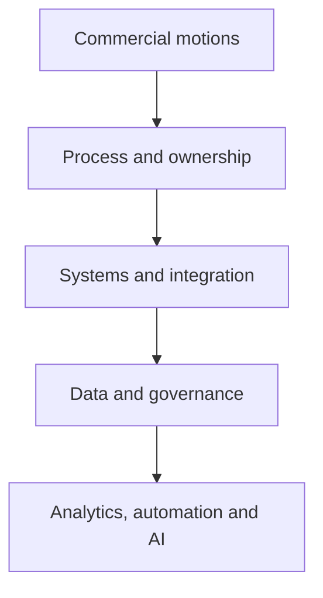

# Christopher Swarup — GTM Operating Systems and AI-Enabled Operations

**Marketing Operations · Revenue Operations · GTM transformation · AI-assisted decision systems · Operator-to-founder execution**

I design and build the operating systems behind predictable B2B revenue. That means connecting commercial strategy, ownership, process, platforms, data and reporting so teams can execute with less ambiguity.

I created this private repository to show how I think and how I work. It is not a CV archive or a collection of old company documents. The useful proof is in the decisions, trade-offs, operating models and practical tools.

## Start here

| You are reviewing me as a… | Recommended path | What it should help you judge |
|---|---|---|
| **Potential employer** | [Employer Brief](EMPLOYER-BRIEF.md) → [Professional Profile](PROFILE.md) → [Revenue Operating System case](case-studies/flagship/revenue-operating-system.md) | Can I diagnose, design and lead complex GTM operating change? |
| **CMO or Marketing leader** | [Campaign Operations case](case-studies/flagship/campaign-operations-os.md) → [MOPS operating model](frameworks/mops-operating-model.md) → [Pipeline case](case-studies/flagship/pipeline-truth-and-attribution.md) | Can I turn Marketing Operations into commercially accountable infrastructure? |
| **CRO, COO or Revenue leader** | [Operator Thesis](OPERATOR-THESIS.md) → [Revenue Operating System](frameworks/revenue-operating-system.md) → [Pipeline Truth](frameworks/pipeline-truth.md) | Can I create a revenue spine that teams can actually run and forecast from? |
| **Investor or adviser** | [Investor Brief](INVESTOR-BRIEF.md) → [Building Lynr](case-studies/ventures/building-lynr.md) → [GTM Command Center](skills/command-center/README.md) | Can my operating experience become repeatable services, tools or products? |
| **Technical or operations reviewer** | [Skills Library](skills/README.md) → [Lifecycle validator](tools/lifecycle-validator/README.md) → [Pipeline scanner](tools/pipeline-quality-scanner/README.md) | Is the logic clear, testable and governed? |

The longer review paths are in [REVIEWER-GUIDE.md](REVIEWER-GUIDE.md).

## The work I am strongest at

I am usually brought into situations where a GTM organisation has outgrown the way it was wired:

- Marketing and Sales no longer agree on what the numbers mean
- Lifecycle definitions differ by team, region or system
- Handoffs depend on individual judgement rather than agreed rules
- CRM and martech logic have become harder to explain than the process itself
- Campaign delivery is busy but difficult to prioritise, measure or improve
- Reporting is technically available but not trusted
- AI or automation is being added before the operating foundation is ready

My work is to make the important decisions explicit, put ownership around them, translate them into systems and data, and create a governance model that can survive beyond the initial build.

## Completed proof

| Evidence | What you can inspect | Status |
|---|---|---|
| [Revenue Operating System](case-studies/flagship/revenue-operating-system.md) | Cross-functional diagnosis, design, sequencing and governance | Complete |
| [Unified Lifecycle Governance](case-studies/flagship/unified-lifecycle-governance.md) | Definitions, ownership, handoffs, routing, recycling and adoption | Complete |
| [Campaign Operations OS](case-studies/flagship/campaign-operations-os.md) | Intake, readiness, build, QA, launch, follow-up and improvement | Complete |
| [Pipeline Truth and Attribution](case-studies/flagship/pipeline-truth-and-attribution.md) | Source, influence, progression, forecast evidence and reporting confidence | Complete |
| [Modern MOPS Team Operating Model](case-studies/leadership/modern-mops-team-operating-model.md) | Team design, service model, priorities, distributed delivery and adoption | Complete |
| [Operating frameworks](frameworks/README.md) | Five reusable models covering revenue, lifecycle, campaigns, pipeline and MOPS | Complete |
| [GTM Command Center](skills/command-center/README.md) | How I structure AI-assisted analysis without removing human accountability | Reconstructed architecture |
| [Runnable tools](tools/README.md) | Two small synthetic tools with explicit rules and unit tests | Complete |
| [Building Lynr](case-studies/ventures/building-lynr.md) | How I turned operator experience into a scoped service and delivery model | Complete retrospective |
| [Entrepreneur Journey](ENTREPRENEUR-JOURNEY.md) | How my operating work has developed into venture and product thinking | Complete overview |

## My operating principle

> Build the operating foundation first. Add automation and AI only when the underlying decisions, ownership and data can be trusted.

The order matters. AI does not fix unclear ownership or contested definitions. It simply produces faster output from a weak foundation.

## Case studies

- [Revenue Operating System](case-studies/flagship/revenue-operating-system.md)
- [Unified Lifecycle Governance](case-studies/flagship/unified-lifecycle-governance.md)
- [Campaign Operations OS](case-studies/flagship/campaign-operations-os.md)
- [Pipeline Truth and Attribution](case-studies/flagship/pipeline-truth-and-attribution.md)
- [Modern MOPS Team Operating Model](case-studies/leadership/modern-mops-team-operating-model.md)
- [Building Lynr](case-studies/ventures/building-lynr.md)

## Frameworks

- [Revenue Operating System](frameworks/revenue-operating-system.md)
- [Lifecycle Governance](frameworks/lifecycle-governance.md)
- [Campaign Operations](frameworks/campaign-operations.md)
- [Pipeline Truth](frameworks/pipeline-truth.md)
- [Modern MOPS Operating Model](frameworks/mops-operating-model.md)

## AI, skills and runnable proof

I do not treat AI as a separate layer of theatre. I use it where the decision, evidence and human accountability are clear.

- [Skills and Systems](SKILLS-AND-SYSTEMS.md)
- [Skills Library](skills/README.md)
- [GTM Command Center](skills/command-center/README.md)
- [CRM Data Quality Auditor — draft specification](skills/crm-data-quality-auditor/README.md)
- [Pipeline Quality Scanner](tools/pipeline-quality-scanner/README.md)
- [Lifecycle Transition Validator](tools/lifecycle-validator/README.md)

The two runnable tools use fictional data and explicit rules. They do not connect to production systems or make business decisions automatically.

## Professional and founder context

- [Employer Brief](EMPLOYER-BRIEF.md)
- [Investor Brief](INVESTOR-BRIEF.md)
- [Professional Profile](PROFILE.md)
- [Operator Thesis](OPERATOR-THESIS.md)
- [Entrepreneur Journey](ENTREPRENEUR-JOURNEY.md)

## How I handle evidence

I have deliberately avoided filling this repository with unsupported metrics or polished claims that cannot be checked.

Each major asset is labelled as one of the following:

- **Composite implemented experience — independently reconstructed**
- **Original portfolio framework**
- **Portfolio-safe skill specification**
- **Synthetic demonstration**
- **Independent strategic exercise**
- **Venture retrospective**
- **Concept under development**

Public employer names, role titles and dates appear only in [PROFILE.md](PROFILE.md). The operating work is company-neutral and rebuilt from scratch.

## Privacy and company boundary

This repository does not contain real customer or employee data, production exports, internal screenshots, copied employer documents, private system designs, confidential metrics, credentials or personal information.

All examples use fictional organisations and synthetic records. The controls are documented in:

- [Confidentiality Policy](CONFIDENTIALITY.md)
- [Security Policy](SECURITY.md)
- [Source Provenance](SOURCE-PROVENANCE.md)
- [Review Checklist](REVIEW-CHECKLIST.md)
- [Controlled Release QA](RELEASE-QA-2026-07-18.md)

---

**Private portfolio · Controlled reviewer access · Not for redistribution**