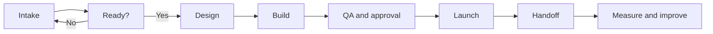

# Building a Scalable Campaign Operations System

> **Evidence classification:** Composite implemented experience — independently reconstructed.

## What this case is about

Campaign work was getting done, but too much of the operating knowledge sat in people’s heads. Requests arrived through different channels, deadlines were agreed before the work was understood, and quality depended on who happened to pick the request up.

The business did not need another campaign checklist. It needed one operating model covering intake, readiness, build, quality assurance, launch, handoff, measurement and learning.

## What I was seeing

- Requests arrived through multiple channels with incomplete requirements
- Deadlines were agreed before scope or dependencies were understood
- Naming, statuses and tracking varied
- Senior operators spent time rebuilding repeatable work
- QA happened late and inconsistently
- Campaign responses were not always connected to a clear owner or SLA
- Reporting focused on activity without a shared progression definition
- Lessons were discussed but not converted into operating changes

## The root cause

Campaign work had been treated as a production queue rather than an end-to-end commercial process.

The missing system included:

- A shared intake and prioritisation method
- Definition of Ready
- Standard build patterns
- Decision and approval rights
- Data and consent controls
- Definition of Done
- Handoff and acceptance
- Measurement contracts
- Continuous-improvement governance

## My role

I designed the operating model, defined decision rights and standards, connected campaign work to platform and data governance, established quality and release controls, and created the structure for distributed delivery and adoption.

## The target model

## The decisions I made

### Intake and prioritisation

- Created one visible request path
- Required objective, audience, offer, owner, deadline and measurement intent
- Evaluated impact, risk, effort and dependency
- Distinguished planned work from approved exceptions

### Build and platform governance

- Created standard campaign patterns where repeatability reduced risk
- Separated global platform rules from legitimate local variation
- Defined access and restricted actions
- Connected campaign build to authoritative data and integration requirements

### Quality and release

- Introduced evidence-based QA rather than informal checking
- Assigned launch approval to a named owner
- Increased review for high-risk consent, data, routing or customer-impact decisions
- Recorded defects and exceptions so recurring problems became improvement work

### Handoff and follow-up

- Defined the receiving owner
- Established response and disposition expectations
- Made acceptance and failure visible
- Connected campaign operations to lifecycle and routing governance

### Measurement

- Separated activity, response, progression and pipeline
- Required tracking and taxonomy before launch
- Published metric definitions
- Used post-launch review to change templates, rules and prioritisation

## How I thought about distributed delivery

Repeatable production could move to a distributed team or partner only after standards, templates, QA and escalation were explicit.

Senior judgement still needed to own:

- Architecture
- High-risk exceptions
- Data and consent decisions
- Cross-functional conflict
- Release risk
- Continuous improvement

The point was not to move work away from senior operators at any cost. It was to stop using senior judgement for repeatable production while keeping it close to the decisions where risk and ambiguity mattered.

## What changed

The operating model created:

- More consistent delivery quality
- Clearer prioritisation and capacity conversations
- Less reliance on individual memory
- Better connection between campaign activity and commercial follow-up
- Stronger platform and data governance
- A usable model for distributed production
- A mechanism for learning rather than repeated rework

I have intentionally left out exact employer metrics. The useful part of this case is the operating design and the trade-offs behind it.

## What I learned

- A form is not an intake process unless it changes prioritisation and readiness decisions
- Speed improves when rework and ambiguity fall, not when QA is removed
- Campaign Operations is incomplete without a receiving owner and follow-up rule
- Standardisation should protect quality and learning, not eliminate justified variation
- The best campaign retrospective produces an operating change, not only a slide

## Related asset

- [Campaign Operations OS framework](../../frameworks/campaign-operations.md)