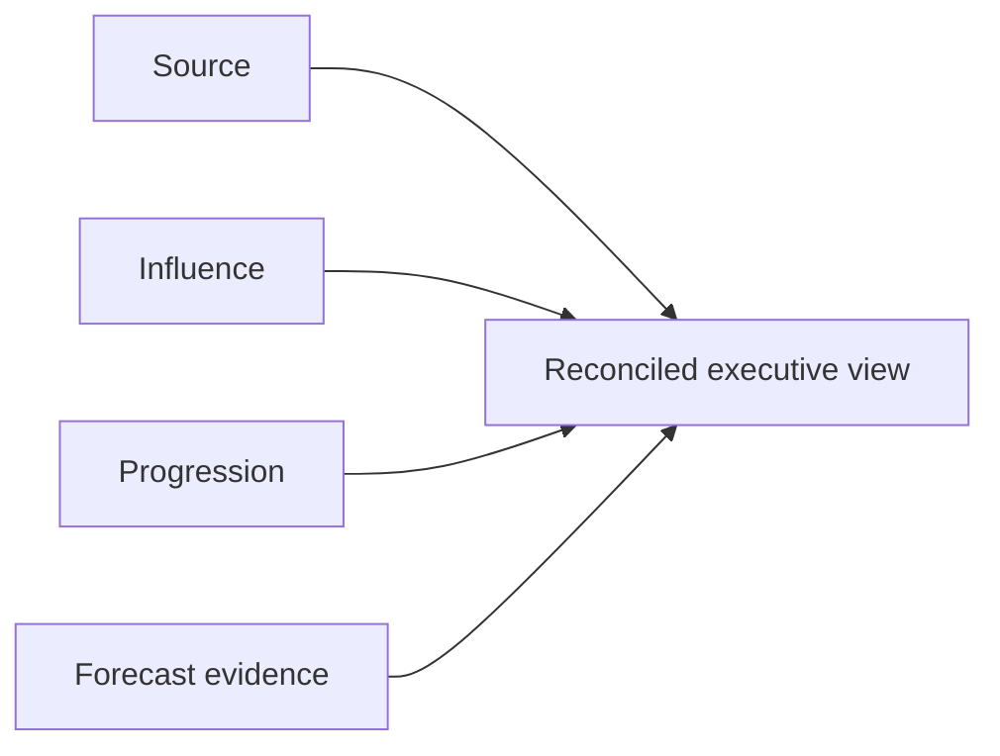

# Establishing Pipeline Truth and Attribution

> **Evidence classification:** Composite implemented experience — independently reconstructed.

## What this case is about

The disagreement was not simply that Marketing, Sales and Finance preferred different numbers. They were answering different questions with reports that used the same labels.

That is why the usual response—build another dashboard—would not have solved the problem.

The work was to separate source, influence, lifecycle progression and forecast confidence so each could be measured properly without pretending one model explained everything.

## What I was seeing

- Marketing-sourced pipeline changed by report
- Sales disputed contribution claims
- Opportunity and contact populations did not reconcile
- Later activity overwrote original source
- Influence models rewarded volume of touches rather than decision value
- Forecast confidence depended on narrative rather than evidence
- Executive meetings spent time debating definitions

## My role

I led the operating definition, data and reporting design required to create a defensible measurement system, including ownership, reconciliation and executive use.

## The design

## The distinctions I made explicit

### Source

Where the recognised relationship began under a published hierarchy.

### Influence

Which interactions materially supported progression. Influence did not overwrite source.

### Progression

The authoritative commercial state of the record or opportunity.

### Forecast evidence

The quality of the expected outcome based on qualification, activity, stage age, close-date movement and next steps.

## The controls I introduced

- Published source hierarchy
- Separate influence model
- Canonical opportunity population
- Stage and close-date quality rules
- Reconciliation between operational and executive reports
- Metric contracts with owner and review date
- Known exclusions made visible
- Human ownership for exceptions and corrections

## The metric contract

For every material metric, I wanted the reviewer to be able to answer:

| Element | Question |
|---|---|
| Definition | What exactly is counted? |
| Population | Which records are included? |
| Window | Which dates govern inclusion? |
| Authority | Which system and field decide? |
| Refresh | When is the number current? |
| Exclusions | What is deliberately omitted? |
| Reconciliation | How does it connect to Finance or Sales reporting? |
| Owner | Who resolves disputes? |

## What changed

The conversation moved away from “whose dashboard is right?” and towards:

- Which question are we answering?
- Which evidence supports it?
- Where do the populations differ?
- What remains unknown?
- Who owns the decision?

That is the real outcome I care about. Reporting becomes useful when people can explain the number, challenge it and understand its limits.

## The limitations

Attribution does not prove causation. Forecast scoring does not replace accountable commercial judgement. A trustworthy system makes those limits visible rather than hiding them behind a precise-looking number.

## Related assets

- [Pipeline Truth framework](../../frameworks/pipeline-truth.md)
- [Pipeline quality scanner](../../tools/pipeline-quality-scanner/README.md)