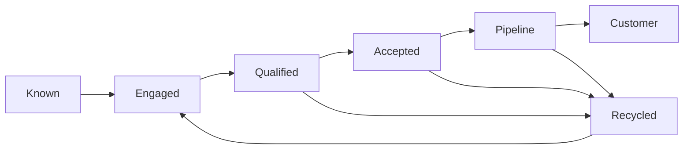

# Creating Unified Lifecycle Governance

> **Evidence classification:** Composite implemented experience — independently reconstructed.

## Executive summary

The lifecycle existed in several places at once: campaign logic, automation platforms, CRM fields, sales practice and executive reports. The labels looked similar, but the meaning, owner and progression rules differed.

The objective was to create one usable commercial language without pretending every motion was identical.

## Presenting symptoms

- Marketing and Sales used different definitions of qualified
- Records skipped stages through automation or manual updates
- Accepted and rejected handoffs were not visible
- Recycling reasons were incomplete
- Engagement activity overwrote commercial state
- Reports used different stage populations
- Teams created local workarounds to keep operating

## Root cause

The lifecycle had been treated as a technical field rather than an operating agreement.

No single artefact defined:

- Meaning
- Entry and exit criteria
- Record owner
- Decision owner
- Authoritative object
- SLA
- Stop condition
- Recycling
- Exception handling
- Measurement

## My role

I led the definition and governance design, brought functional stakeholders into the decision process, translated the approved model into system and data requirements, and established the adoption and review mechanism.

## Target design

The diagram was the least important output. The operating definitions behind it were the system.

## Decision architecture

For every transition, the design answered:

1. What evidence is required?
2. Which system holds the evidence?
3. Who owns the record before the transition?
4. Who accepts responsibility after it?
5. What happens if the transition is rejected?
6. What clock starts?
7. Which exception is permitted?
8. How is the exception approved and measured?

## Implementation

### Definition

- Reconciled existing stage and status meanings
- Separated interaction signals from lifecycle authority
- Defined progression and recycling criteria
- Established one current authoritative state

### Ownership

- Named record and decision owners
- Made acceptance visible
- Defined escalation for disputed records
- Removed ownership rules hidden only in automation

### Systems and data

- Mapped fields and integrations to the approved model
- Identified legacy logic that could overwrite state
- Defined minimum critical fields
- Tested valid and invalid scenarios with synthetic records

### Adoption

- Trained through live operational decisions
- Published examples and exception paths
- Measured transition validity, ageing and recycling quality
- Reviewed exceptions to identify design debt

## Outcome

The organisation gained:

- One lifecycle language
- More visible handoff quality
- Clearer routing and SLA accountability
- Better separation between activity and commercial state
- More consistent reporting populations
- A governed route for change

## What did not work

Documentation alone did not create adoption. Teams changed behaviour only when the lifecycle was connected to their next action, service expectation and escalation route.

## Related assets

- [Lifecycle Governance framework](../../frameworks/lifecycle-governance.md)
- [Lifecycle transition validator](../../tools/lifecycle-validator/README.md)
