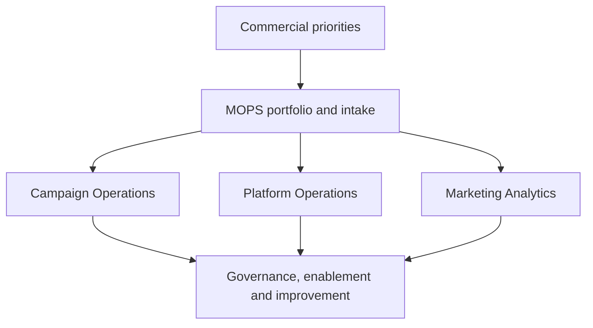

# Moving Marketing Operations from Service Desk to Operating-System Function

> **Evidence classification:** Composite implemented leadership experience — independently reconstructed.

## What this case is about

The team was busy, responsive and valued. That was not the problem.

The problem was that urgency and relationships controlled the workload. Strategic work competed with campaign requests, platform debt and reporting incidents, and the function had very little space to improve the system it was being asked to run.

My aim was to make Marketing Operations accountable for a visible portfolio of commercial infrastructure rather than a hidden queue of tasks.

## The starting point

- Requests arrived through multiple channels
- Priority depended on seniority and escalation
- Campaign production consumed senior judgement
- Platform ownership was distributed and unclear
- Analytics reacted to questions rather than shaping decisions
- Documentation existed outside the flow of work
- Offshore or partner delivery lacked a clear decision boundary

## What I wanted the function to become

A team that could:

- Run reliable campaign and platform operations
- Own the Marketing operating portfolio
- Partner credibly with commercial leadership
- Protect architecture and data quality
- Build repeatable delivery
- Transfer knowledge instead of creating dependency

## The target model

## The changes I made

### Service catalogue

I defined what the function owned, co-owned, advised and did not own. That sounds simple, but it changed a large number of conversations about priority and accountability.

### Intake and portfolio

I introduced one visible intake and prioritisation model based on commercial impact, risk, dependency and effort.

### Decision rights

I separated production tasks from architecture, approval and exception decisions so senior operators were not spending their time rebuilding repeatable work.

### Distributed delivery

I moved repeatable production into governed delivery models while keeping senior ownership of quality, design and learning.

### Platform stewardship

I created ownership for roadmap, integration, access, data and change control.

### Analytics

I connected reporting work to decisions, metric contracts and operating cadence rather than allowing the team to become a dashboard request service.

### Enablement

I embedded documentation, training and handback into delivery instead of treating them as a final communications task.

## How I led the change

- Made trade-offs explicit
- Protected the team from invisible demand
- Gave senior operators time for architecture and improvement
- Used incidents and exceptions as evidence of operating debt
- Built credibility through narrow, defensible commitments
- Developed people through ownership, not only task volume

## What changed

The function became easier to understand, govern and invest in. Stakeholders could see what was being delivered, why it mattered, where capacity was constrained and which decisions required leadership intervention.

The deeper change was that the team was no longer valued only for how quickly it responded. It was valued for helping the organisation make better operating decisions.

## What I learned

A strategic MOPS function is not created by changing the team name. It is created by changing its decision rights, portfolio, service model and accountability.

That shift only becomes credible when the team can still run the day-to-day operation reliably while creating enough space to improve the system behind it.