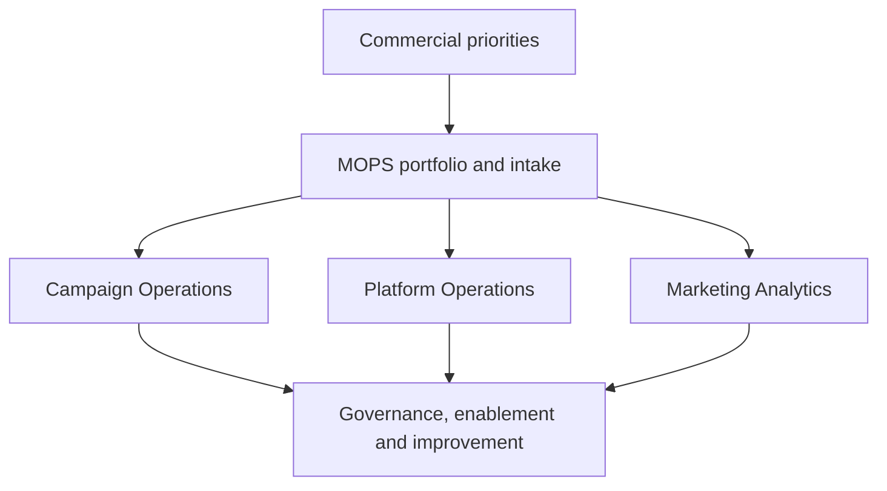

# Moving Marketing Operations from Service Desk to Operating-System Function

> **Evidence classification:** Composite implemented leadership experience — independently reconstructed.

## Executive summary

The function was busy, responsive and valued, but its workload was controlled by urgency and relationships. Strategic work competed with campaign requests, platform debt and reporting incidents.

The transformation was to make Marketing Operations accountable for a visible portfolio of commercial infrastructure rather than a hidden queue of tasks.

## Starting point

- Requests arrived through multiple channels
- Priority depended on seniority and escalation
- Campaign production consumed senior judgement
- Platform ownership was distributed and unclear
- Analytics reacted to questions rather than shaping decisions
- Documentation existed outside the flow of work
- Offshore or partner delivery lacked a clear decision boundary

## Leadership objective

Create a function that could:

- Run reliable campaign and platform operations
- Own the Marketing operating portfolio
- Partner credibly with commercial leadership
- Protect architecture and data quality
- Build repeatable delivery
- Transfer knowledge instead of creating dependency

## Target model

## Changes made

### Service catalogue

Defined what the function owned, co-owned, advised and did not own.

### Intake and portfolio

Introduced one visible intake and prioritisation model based on commercial impact, risk, dependency and effort.

### Decision rights

Separated production tasks from architecture, approval and exception decisions.

### Distributed delivery

Moved repeatable production into governed delivery models while retaining senior ownership of quality, design and learning.

### Platform stewardship

Created ownership for roadmap, integration, access, data and change control.

### Analytics

Connected reporting work to decisions, metric contracts and operating cadence.

### Enablement

Embedded documentation, training and handback into delivery rather than treating them as a final communications task.

## Leadership approach

- Make trade-offs explicit
- Protect the team from invisible demand
- Give senior operators time for architecture and improvement
- Use incidents and exceptions as evidence of operating debt
- Build credibility through narrow, defensible commitments
- Develop people through ownership, not only task volume

## Outcome

The function became easier to understand, govern and invest in. Stakeholders could see what was being delivered, why it mattered, where capacity was constrained and which decisions required leadership intervention.

## Lesson

A strategic MOPS function is not created by changing the team name. It is created by changing its decision rights, portfolio, service model and accountability.
