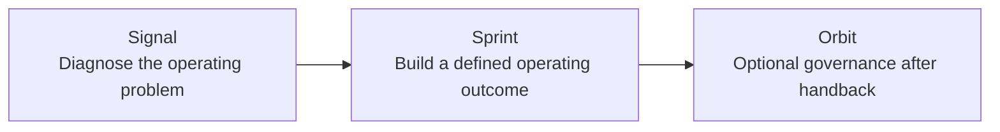

# Building Lynr: Turning Operator Experience into a Revenue-Execution Model

> **Evidence classification:** Owned venture retrospective. No customer claims, private financial information or confidential delivery material are included.

## Why I started Lynr

Lynr began with a practical observation from years of operating work: many growth-stage companies do not lack strategy. They lack experienced execution between the strategy deck and the internal team expected to make it real.

I wanted to test whether senior Revenue and GTM operating work could be delivered through clearly scoped builds that leave the client stronger rather than permanently dependent.

## The gap I saw

Companies often face two unsatisfactory options:

1. Hire a senior permanent operator before the role and operating model are fully understood.
2. Buy advisory work that identifies the problem but leaves implementation with an already stretched team.

The space between those options is senior execution that can diagnose, build, document and hand back the operating system.

## The model I designed

### Signal

A short diagnostic to identify the real operating constraint, check the evidence and decide whether a build is justified.

### Sprints

Time-bounded senior execution focused on a defined operating outcome such as lifecycle, pipeline truth, handoff quality, revenue readiness or the wider revenue operating spine.

### Orbit

Optional governance after the build to protect adoption and decision quality without creating a permanent delivery dependency.

## The choices that mattered

### Senior-led delivery

I did not want the model to depend on junior leverage. One named senior operator remains accountable for the diagnosis, decisions, quality and handback.

### A clear Definition of Done

Each engagement needs a written scope, explicit outputs, acceptance criteria, dependencies and boundaries. “Improve RevOps” is not a deliverable.

### Specialists without a marketplace problem

Specialists can support defined work where their expertise is needed, but the client should not have to manage a directory of advisers. One accountable lead owns the engagement.

### Transfer by design

Documentation, governance and enablement are part of delivery. The objective is a working system the internal team can run.

### No outcome theatre

I will not guarantee business outcomes that depend on market conditions, team behaviour or decisions outside the engagement. The commitment is to defined work, operating quality and a clean handback.

## What could become a moat

The possible advantage is not access to AI or a list of experienced people. It is the combination of:

- Senior diagnostic judgement
- Reusable operating frameworks
- Clear scope and Definition of Done
- Evidence and decision standards
- Specialist support under one accountable lead
- Documentation and handback discipline
- A growing library of practical tools and diagnostics

That remains a hypothesis until repeated demand and delivery prove it.

## What I built

- The market and customer problem thesis
- Positioning around senior revenue execution
- The Signal, Sprint and Orbit offer architecture
- Delivery and handback principles
- Scope, risk and change-control boundaries
- Website information architecture and messaging
- Pain-led customer journeys
- Stage-specific and role-specific content
- Training and enablement positioning
- A partner and senior-operator relationship model

## How the thinking changed

The model changed materially through critique and iteration:

- I simplified the website rather than adding more offers.
- I moved away from generic consultancy language and towards visible operating problems.
- I made it explicit that one Lynr lead remains accountable when specialists contribute.
- I made handback and anti-dependency part of the proposition rather than a footnote.
- I removed public sign-up paths that did not match the buying journey.
- I treated Orbit as optional governance rather than an inevitable retainer.
- I added training only where it supports live operating behaviour, not as generic courseware.
- I avoided invented client proof and unsupported outcome claims.

## What this work shows

- I can turn accumulated operator experience into a structured offer.
- I can define commercial boundaries before trying to scale.
- I can translate a delivery philosophy into operating rules.
- I can build a market narrative without relying on inflated claims.
- I can connect content, website, service design and delivery governance.
- I am willing to simplify or change direction when the critique is right.

## What is still unproven

- Repeatable demand across the intended market
- Sustainable acquisition economics
- Delivery capacity beyond the founders and senior network
- How much of the diagnostic and build process can become software
- Whether the strongest long-term model is a firm, platform or hybrid

Those are not gaps I want to hide. They are the next questions the venture has to answer.

## Relationship to this portfolio

The frameworks and diagnostics in this repository are the operating foundation behind Lynr. This portfolio is not a marketing site for the venture. It is the evidence of how I think, what I have built and which parts of the model still need to be proven.