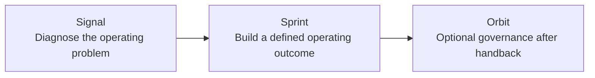

# Building Lynr: Turning Operator Experience into a Revenue-Execution Model

> **Evidence classification:** Owned venture retrospective. No customer claims, private financial information or confidential delivery material are included.

## Executive summary

Lynr began with a practical market observation: many growth-stage companies do not lack strategy. They lack experienced execution capacity between the strategy deck and the internal team expected to deliver it.

The venture explores whether senior Revenue and GTM operating work can be packaged as clearly scoped, accountable builds that leave the client stronger rather than permanently dependent.

## The problem thesis

Companies commonly face one of two options:

1. Hire a senior permanent operator before the role and operating model are fully defined.
2. Buy advisory work that identifies the problem but leaves implementation with an already stretched team.

The gap is senior execution that can diagnose, build, document and hand back the operating system.

## The model

### Signal

A short diagnostic designed to identify the real operating constraint, establish the evidence and define whether a build is justified.

### Sprints

Time-bounded senior execution focused on a defined operating outcome such as lifecycle, pipeline truth, handoff quality, revenue readiness or the revenue operating spine.

### Orbit

Optional post-build governance intended to protect adoption and decisions without creating permanent delivery dependency.

## Core design choices

### Senior-led delivery

The model does not depend on junior leverage. A named senior operator remains accountable for diagnosis, decisions, quality and handback.

### Clear Definition of Done

Each engagement requires a written scope, explicit output, acceptance criteria, dependencies and boundaries.

### Partner-enabled, not directory-led

Specialists may support defined work where their expertise is required. The client does not have to manage a marketplace of advisers; one accountable lead owns the engagement.

### Transfer by design

Documentation, governance and enablement are part of delivery. The objective is a working system the internal team can operate.

### No outcome theatre

The model does not guarantee business outcomes that depend on market conditions, team behaviour or decisions outside the engagement. It commits to defined work, operating quality and clean handback.

## Operating moat hypothesis

The potential moat is not access to AI or a list of experienced people. It is the combination of:

- Senior diagnostic judgement
- Reusable operating frameworks
- Structured scope and Definition of Done
- Evidence and decision standards
- Specialist support under one accountable lead
- Documentation and handback discipline
- A growing library of synthetic tools and diagnostics

This remains a hypothesis until repeated delivery and market demand are evidenced.

## What was built

- Market and customer problem thesis
- Positioning around senior revenue execution
- Signal, Sprint and Orbit offer architecture
- Defined delivery and handback principles
- Risk, scope and change-control boundaries
- Website information architecture and messaging
- Pain-led customer journeys
- Stage-specific and role-specific content
- Training and enablement positioning
- Partner and senior-operator relationship model

## Iteration and judgement

The venture changed materially through review and critique:

- Simplified the website rather than adding more offers
- Moved from generic consultancy language to visible operating problems
- Clarified that one Lynr lead remains accountable when specialists contribute
- Made handback and anti-dependency explicit
- Removed public sign-up paths that did not match the buying journey
- Treated Orbit as optional governance rather than an inevitable retainer
- Added training only where it supports live operating behaviour, not as generic courseware
- Avoided invented client proof and unsupported outcome claims

## What the venture demonstrates

- Translating accumulated experience into an offer system
- Designing commercial boundaries before scale
- Turning delivery philosophy into operating rules
- Building a market narrative without relying on inflated claims
- Iterating through external feedback
- Connecting content, website, service design and delivery governance

## What remains unproven

- Repeatable demand across the intended market
- Sustainable acquisition economics
- Delivery capacity beyond the founders and senior network
- How much of the diagnostic and build process can become software
- Whether the model is best expressed as a firm, platform or hybrid

Those uncertainties are not weaknesses to hide. They are the next questions the venture must answer.

## Relationship to this portfolio

The frameworks and diagnostics in this repository are the operator foundation beneath Lynr. The portfolio is not a marketing site for the venture; it is evidence of the judgement and systems from which the venture emerged.
