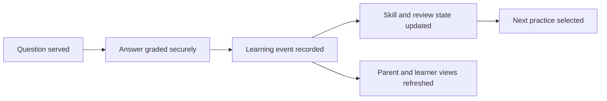

# Building ThinkBud: Eight Months Turning a Learning Idea into a Working Platform

> **Evidence classification:** Owned venture build. This case describes the product, architecture and decisions at a portfolio-safe level. It does not reproduce source code, production configuration or private learner data.

## Why this is one of the most important things I have built

ThinkBud has been the biggest product build of my life so far.

I spent nearly eight months taking it from an idea into a working, invite-only learning platform for UK 11+ preparation. I did not only shape the concept or commission a prototype. I worked through the product model, learning logic, content structure, data architecture, user journeys, security, billing, testing, release controls and the hundreds of small decisions required to make the system coherent.

It has stretched me beyond Revenue and Marketing Operations into product management, learning design, software architecture, AI-assisted development, child safety and founder execution.

## The problem I wanted to solve

A lot of exam-preparation products provide more questions. That is useful, but it does not automatically tell a parent whether their child is improving, what they are forgetting or what they should practise next.

The idea behind ThinkBud was to build a calmer and more intelligent daily-practice product:

- Short practice that a child can sustain
- Question selection informed by what the learner knows and forgets
- Review driven by previous performance rather than a fixed worksheet sequence
- Parent visibility without turning the experience into surveillance
- Clear boundaries between the parent account and the child practice experience
- A product that earns trust before attempting a broad public launch

## What I built

ThinkBud reached a controlled, invite-only beta with a live web application and a working end-to-end learning flow.

The product includes:

- Parent account creation and learner onboarding
- Child practice sessions across core 11+ subjects
- Adaptive question selection
- Spaced repetition at question and skill level
- Server-side answer grading
- A review experience for missed or due material
- Learner progress, streak and subject projections
- Parent-facing insight surfaces
- Subscription and entitlement logic
- Admin and content-management controls
- Unit, integration and end-to-end testing
- Automated build and release checks

## The learning-intelligence model

The core product question was not simply, “Which question should appear next?”

It was:

> Given what this learner has attempted, understood, missed, recently seen and is likely to forget, what is the most useful next practice?

The selection model combines several signals rather than relying on one score:

- Current skill mastery
- Difficulty fit
- Freshness and recent exposure
- Questions due for spaced review
- Subject balance
- Fallback rules when the ideal question pool is too small

I also separated the learning event from the current learner state. Every answer becomes part of an append-only learning history, while dashboards and current-state views are rebuilt from that history. That gives the product a more reliable base for future analysis than repeatedly overwriting the latest score.

## Why I used AI in the build

I used AI-assisted development tools throughout the build, but not as a substitute for product ownership.

AI helped me move faster through code generation, debugging, documentation, testing ideas and implementation options. I still had to decide:

- What the product should do
- Which system should be authoritative
- How learner state should be modelled
- Which failures were acceptable and which were not
- What belonged on the critical answer-submission path
- How to protect answer integrity
- When to freeze a working flow rather than keep changing it
- What evidence was strong enough to support the next product decision

That distinction matters. The build demonstrates that I can use AI to extend my execution capacity while retaining responsibility for the product, architecture and release decisions.

## Product and technical architecture

The platform uses a modern web stack with a React and TypeScript frontend, a Supabase and Postgres backend, server-side functions, Stripe for subscription flows, and automated testing through GitHub Actions, Vitest and Playwright.

The more important architectural decisions were not the technologies themselves. They were the boundaries:

### Parent and learner model

The parent controls the account, billing and protected parent surfaces. The child uses a focused practice experience rather than an open social or conversational product.

### Event-sourced learning record

Answer attempts are stored as the canonical learning history. Current streaks, levels, summaries and mastery views are projections from those events rather than competing sources of truth.

### Server-authoritative grading

Answers are graded on the server, with protected answer content withheld until submission. This reduces the risk of exposing the correct response through the client.

### Controlled entitlements

Access is based on server-owned trial and subscription state rather than only front-end visibility rules.

### Feature and release controls

New capabilities can be introduced behind feature flags, tested, monitored and paused without destabilising the learning flow.

## Child safety and trust

Building for children changed the standard I applied to the product.

I treated issues involving learner information, parent controls, answer exposure, inappropriate content, billing access and admin permissions as product-critical—not as secondary technical tasks.

The product includes:

- Parent and learner access boundaries
- Parent PIN protection for adult surfaces
- Server-side ownership and permission checks
- Restricted admin access
- No open child-facing AI chat
- No public child profiles or social features
- Payment processing handled through Stripe rather than storing payment-card data
- A controlled beta rather than unrestricted public signup

I deliberately slowed the launch when the safer choice was to verify the operating baseline first.

## Content was a product system, not a spreadsheet

The platform also required a structured question and skill model across Maths, English, Verbal Reasoning and Non-Verbal Reasoning.

That meant thinking about:

- Subject and skill taxonomy
- Exam-board and level alignment
- Question difficulty
- Correct answers and explanations
- Content quality and duplication
- Review suitability
- How content signals feed the adaptive engine

The content model, learning model and software model had to work together. Improving one while ignoring the others would have created a product that looked complete but could not learn reliably from use.

## How I worked through the build

The build was highly iterative. I moved repeatedly between product questions and implementation detail:

1. Define the learning and parent problem
2. Design the first usable journey
3. Build the practice and answer flow
4. Establish the canonical learning record
5. Add mastery, spaced review and adaptive selection
6. Strengthen parent controls and security
7. Add billing and entitlement logic
8. Build automated tests and release checks
9. Audit data, content and edge cases
10. Move to a closed beta instead of forcing a public launch

There were several points where the responsible decision was to stop adding features and stabilise the system already built.

## What this build proves about me

ThinkBud demonstrates a different side of my experience from the GTM case studies.

It shows that I can:

- Take an ambiguous idea and turn it into a functioning product
- Own product decisions across user experience, data, technology and commercial model
- Learn enough technical depth to challenge and shape the architecture
- Use AI-assisted development without surrendering judgement
- Build with security, privacy and child safety in mind
- Create operating documentation, release controls and test coverage
- Stay with a difficult build through months of iteration
- Distinguish an impressive demo from a product that is safe enough to test with real users

## What I learned

### Product complexity compounds quietly

A child answering one question touches content, selection logic, identity, permissions, grading, learning state, review scheduling, analytics and the user experience. The visible screen is the smallest part of the product.

### One source of truth matters as much in a learning product as in RevOps

Competing learner states create the same failure pattern as competing pipeline definitions. I carried the same operating principle into the product: define authority before adding automation.

### AI increases capability, but also the need for discipline

AI made it possible for me to build much further than I could have through traditional solo development. It also made it easier to create code and features faster than the product could safely absorb. Architecture, testing and stopping rules became more important, not less.

### Trust has to be designed into the operating model

Child safety, parent control, billing integrity and answer security cannot be added after the product is successful. They shape how the product must be built from the beginning.

## Current position

ThinkBud has reached controlled beta rather than broad public launch.

What is proven:

- The core product can operate end to end
- Adaptive practice and spaced review are implemented
- Parent and learner journeys exist
- Learning events and learner projections are working
- Billing and access controls are integrated
- Automated testing and release controls are in place
- The product has passed an invite-only live smoke-test baseline

What remains to be proven:

- Learning impact across a larger and more diverse learner population
- Which adaptive signals create the strongest improvement
- Long-term engagement and retention
- Content quality at greater scale
- Sustainable acquisition and unit economics
- The right pace and shape of public launch

I do not present those questions as solved. They are the next stage of the product.

## Why it belongs in this portfolio

ThinkBud is the clearest evidence that I can move beyond advising or designing an operating model and build an entire system from the ground up.

It brings together product thinking, operating discipline, AI-assisted execution, data architecture, commercial design, safeguarding and persistence. It is not separate from the rest of my portfolio. It is the strongest example of how I apply the same principles—clear ownership, authoritative data, explicit rules, controlled automation and human trust—to a completely different problem.