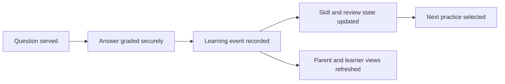

# Building ThinkBud: From a Family Idea to a Learning-Intelligence Platform

> **Evidence classification:** Owned venture build. This case describes the product, architecture and decisions at a portfolio-safe level. It does not reproduce source code, production configuration or private learner data.

**Live site:** [www.thinkbud.co.uk](https://www.thinkbud.co.uk/)

## Where ThinkBud started

ThinkBud began as something I wanted to create for my own children.

The original aim was practical: give them a more useful and manageable way to prepare for the UK 11+. I wanted short daily practice, clearer visibility for a parent and a better way to revisit the things they were forgetting.

As I worked on it, the idea took a different turn. It stopped being only a family project and became a broader product question:

> How should a learning platform use practice history, content structure and spaced review to decide what a learner should do next?

That question turned ThinkBud into the most substantial product build I have completed so far. Over nearly eight months, I worked through the product model, learning logic, content structure, data architecture, user journeys, security, billing, testing, release controls and the hundreds of smaller decisions required to make the system coherent.

## How it connects to my core career

ThinkBud is not a separate identity from my Marketing Operations and Revenue Operations career.

The subject matter is different, but many of the operating questions are the same:

- What is the authoritative record of what happened?
- Which state should the system trust?
- What evidence is required before the next action?
- Which rules can be automated safely?
- Where must a person remain accountable?
- How should exceptions be handled?
- What needs to be tested before a change is released?

In RevOps, those questions apply to lifecycle, pipeline, routing and reporting. In ThinkBud, they apply to learning events, mastery, review, answer integrity, parent controls and product safety.

The build extended my core skills into product management, learning design, software architecture, AI-assisted development and founder execution.

## The problem the product now addresses

A lot of exam-preparation products provide more questions. That can be useful, but more content does not automatically tell a parent whether their child is improving, what they are forgetting or what they should practise next.

ThinkBud developed into a calmer daily-practice model built around:

- Short practice that a child can sustain
- Question selection informed by what the learner knows and forgets
- Review driven by previous performance rather than a fixed worksheet sequence
- Parent visibility without turning the experience into surveillance
- Clear boundaries between the parent account and the child practice experience
- A controlled release posture that prioritises trust over speed

## What I built

ThinkBud reached a controlled, invite-only beta with a live web application and a working end-to-end learning flow.

The product includes:

- Parent account creation and learner onboarding
- Child practice sessions across core 11+ subjects
- Adaptive question selection
- Spaced repetition at question and skill level
- Server-side answer grading
- A review experience for missed or due material
- Learner progress, streak and subject projections
- Parent-facing insight surfaces
- Subscription and entitlement logic
- Admin and content-management controls
- Unit, integration and end-to-end testing
- Automated build and release checks

## The learning-intelligence model

The core product question is not simply, “Which question should appear next?”

It is:

> Given what this learner has attempted, understood, missed, recently seen and is likely to forget, what is the most useful next practice?

The selection model combines several signals rather than relying on one score:

- Current skill mastery
- Difficulty fit
- Freshness and recent exposure
- Questions due for spaced review
- Subject balance
- Fallback rules when the ideal question pool is too small

I separated the learning event from the current learner state. Every answer becomes part of an append-only learning history, while dashboards and current-state views are rebuilt from that history.

That is the same source-of-truth discipline I use in Revenue Operations: preserve what happened, then build current views from an authoritative record.

## How I used AI

I used AI-assisted development tools throughout the build, but not as a substitute for product ownership.

AI helped me move faster through code generation, debugging, documentation, test creation and implementation options. I still had to decide:

- What the product should do
- Which system should be authoritative
- How learner state should be modelled
- Which failures were acceptable and which were not
- What belonged on the critical answer-submission path
- How to protect answer integrity
- When to freeze a working flow rather than keep changing it
- What evidence was strong enough to support the next product decision

The useful proof is not that I used AI. It is that I used it to extend my execution capacity while retaining responsibility for the product, architecture and release decisions.

## Product and technical architecture

The platform uses a React and TypeScript frontend, a Supabase and Postgres backend, server-side functions, Stripe for subscription flows, and automated testing through GitHub Actions, Vitest and Playwright.

The more important decisions were the operating boundaries:

### Parent and learner model

The parent controls the account, billing and protected parent surfaces. The child uses a focused practice experience rather than an open social or conversational product.

### Event-sourced learning record

Answer attempts are stored as the canonical learning history. Current streaks, levels, summaries and mastery views are projections from those events rather than competing sources of truth.

### Server-authoritative grading

Answers are graded on the server, with protected answer content withheld until submission.

### Controlled entitlements

Access is based on server-owned trial and subscription state rather than only front-end visibility rules.

### Feature and release controls

New capabilities can be introduced behind feature flags, tested, monitored and paused without destabilising the learning flow.

## Child safety and trust

Building for children changed the standard I applied to the product.

I treated learner information, parent controls, answer exposure, inappropriate content, billing access and admin permissions as product-critical.

The product includes:

- Parent and learner access boundaries
- Parent PIN protection for adult surfaces
- Server-side ownership and permission checks
- Restricted admin access
- No open child-facing AI chat
- No public child profiles or social features
- Stripe-hosted payment processing
- A controlled beta rather than unrestricted public signup

I deliberately slowed the launch when the safer choice was to verify the operating baseline first.

## Content was part of the product system

The platform required a structured question and skill model across Maths, English, Verbal Reasoning and Non-Verbal Reasoning.

That meant working through:

- Subject and skill taxonomy
- Exam-board and level alignment
- Question difficulty
- Correct answers and explanations
- Content quality and duplication
- Review suitability
- How content signals feed the adaptive engine

The content model, learning model and software model had to work together. Improving one while ignoring the others would have created a product that looked complete but could not learn reliably from use.

## How I worked through the build

The build was highly iterative:

1. Start with the family learning problem
2. Design the first usable parent and learner journey
3. Build the practice and answer flow
4. Establish the canonical learning record
5. Add mastery, spaced review and adaptive selection
6. Strengthen parent controls and security
7. Add billing and entitlement logic
8. Build automated tests and release checks
9. Audit data, content and edge cases
10. Move to a closed beta instead of forcing a public launch

There were several points where the responsible decision was to stop adding features and stabilise the system already built.

## What the build demonstrates

ThinkBud shows that I can:

- Take an ambiguous idea and turn it into a functioning product
- Allow the problem to evolve rather than defending the original concept
- Own decisions across user experience, data, technology and commercial model
- Learn enough technical depth to challenge and shape the architecture
- Use AI-assisted development without surrendering judgement
- Build with security, privacy and child safety in mind
- Create operating documentation, release controls and test coverage
- Stay with a difficult build through months of iteration
- Apply the same operating discipline from my career to a new domain

## What I learned

### Products often become something different from the original idea

ThinkBud started as a tool for my children. The work revealed a wider learning-intelligence problem. The right response was to follow the evidence and reshape the product rather than protect the first version of the idea.

### Product complexity compounds quietly

A child answering one question touches content, selection logic, identity, permissions, grading, learning state, review scheduling, analytics and user experience. The visible screen is the smallest part of the product.

### One source of truth matters in every operating system

Competing learner states create the same failure pattern as competing pipeline definitions. Define authority before adding automation.

### AI increases capability and the need for discipline

AI made it possible for me to build much further than I could have through traditional solo development. It also made it easier to create more code and features than the product could safely absorb. Architecture, testing and stopping rules became more important, not less.

### Trust has to be designed in from the beginning

Child safety, parent control, billing integrity and answer security cannot be added after the product succeeds. They shape how the product must be built.

## Current position

ThinkBud has reached controlled beta rather than broad public launch.

What is proven:

- The core product can operate end to end
- Adaptive practice and spaced review are implemented
- Parent and learner journeys exist
- Learning events and learner projections are working
- Billing and access controls are integrated
- Automated testing and release controls are in place
- The product has passed an invite-only live smoke-test baseline

What remains to be proven:

- Learning impact across a larger and more diverse learner population
- Which adaptive signals create the strongest improvement
- Long-term engagement and retention
- Content quality at greater scale
- Sustainable acquisition and unit economics
- The right pace and shape of public launch

I do not present those questions as solved. They are the next stage of the product.

## Its place in this portfolio

ThinkBud is an important extension of my core career, not the replacement for it.

My main expertise remains Marketing Operations, Revenue Operations, GTM systems, transformation, data, analytics and applied AI. ThinkBud shows that I can take the same principles—clear ownership, authoritative data, explicit rules, controlled automation, testing and trust—and apply them to a product from the ground up.