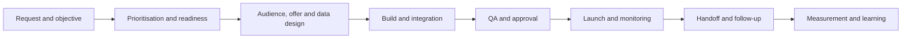

# Campaign Operations OS

> **Evidence classification:** Original portfolio framework synthesising implemented campaign, platform and governance experience.

## Purpose

Campaign Operations converts campaign intent into a reliable, measurable and governable delivery process.

The goal is not to make every campaign identical. It is to standardise the decisions, data, controls and handoffs that should not be reinvented each time.

## Operating flow

## Definition of Ready

A campaign should not enter production until the following are explicit:

- Commercial objective
- Target audience and exclusions
- Offer or action requested
- Channel and journey
- Required data and consent basis
- Ownership and follow-up expectation
- Measurement plan
- Dependencies and deadline
- Named approver

Urgency does not replace readiness. Where an exception is justified, it should be visible and approved.

## Definition of Done

Delivery is not complete when the campaign launches. It is complete when:

- Build and QA evidence are recorded
- Tracking and taxonomy are valid
- Responses reach the correct system and owner
- Follow-up rules are active
- Monitoring is established
- Measurement definitions are agreed
- Documentation and handback are complete
- Known issues and exceptions are recorded

## Campaign operating record

| Element | Required decision |
|---|---|
| Objective | What commercial behaviour should change? |
| Audience | Who is included and excluded? |
| Offer | What is being asked or promised? |
| Journey | What happens before and after the response? |
| Data | Which fields and permissions are required? |
| Build owner | Who creates and tests the campaign? |
| Business owner | Who owns the outcome and follow-up? |
| Approval | Who accepts launch risk? |
| Measurement | What will be counted and why? |
| Review | What learning will change the next campaign? |

## Governance layers

### Intake and prioritisation

Evaluate requests using commercial impact, strategic alignment, customer or regulatory obligation, risk, effort, dependency and reusability.

### Taxonomy and standards

Define campaign types, naming, statuses, source treatment, cost capture and reporting requirements.

### Build and QA

Use standard patterns where they reduce error. Retain additional review for high-risk data, consent, routing or customer-impact decisions.

### Handoff

Define who receives responses, how acceptance is recorded, which SLA applies and what happens when ownership fails.

### Measurement

Separate activity, response, progression, pipeline and learning. Do not imply causation from campaign association alone.

## Roles

| Role | Accountability |
|---|---|
| Business owner | Objective, audience, offer and commercial follow-up |
| Campaign Operations | Build quality, standards, tracking and release control |
| Platform owner | Architecture, integration, access and technical risk |
| Data or privacy owner | Permission, data use and compliance requirements |
| Receiving team | Acceptance, response and disposition |
| Analytics owner | Metric definition and interpretation |

## Measures

- Readiness failure rate
- QA defect rate
- On-time delivery
- Response routing completeness
- Handoff acceptance
- Follow-up SLA attainment
- Tracking completeness
- Rework and exception volume
- Campaign learning implemented

## Limitation

A strong operating process cannot make a weak proposition valuable or a poor audience relevant. Campaign Operations protects execution quality and evidence; it does not replace marketing strategy.
