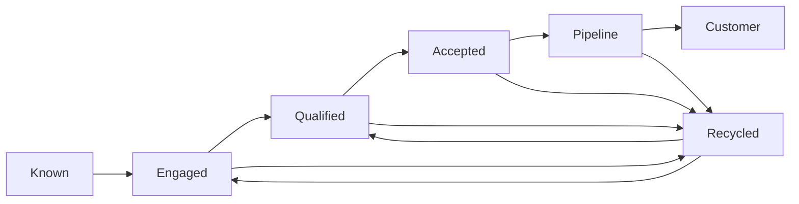
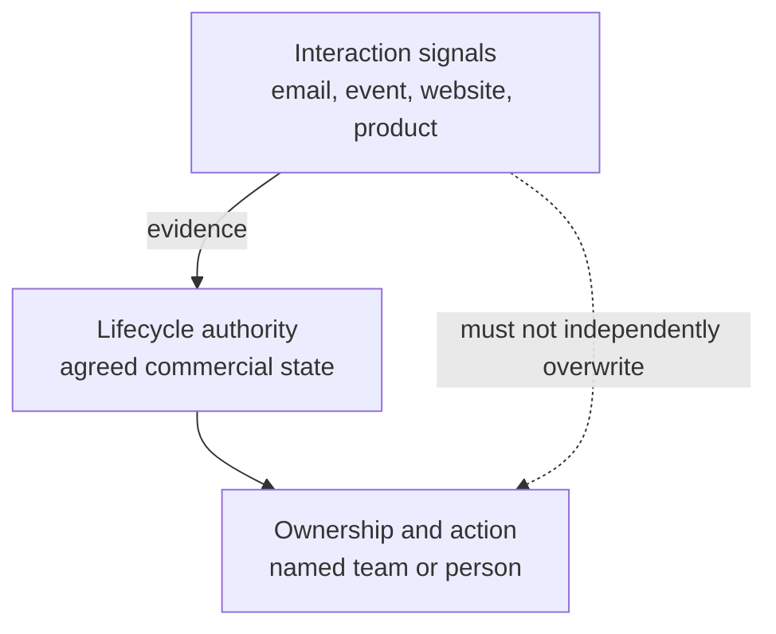

# Unified Lifecycle Governance

> **Evidence classification:** Original portfolio framework synthesising implemented lifecycle and handoff experience.

## Purpose

A lifecycle is the shared operating language through which Marketing, Sales and Customer teams understand record state, ownership and next action.

A stage name without entry criteria, exit criteria, owner and exception logic is not governance.

## Core design

This is an illustrative model, not a universal taxonomy.

## Required definition for every stage

| Component | Required question |
|---|---|
| Business meaning | What does the stage represent commercially? |
| Entry criteria | What must be true before entry? |
| Exit criteria | What must be true before progression? |
| Record owner | Who acts next? |
| Decision owner | Who approves or rejects progression? |
| Authoritative object | Where is state recorded? |
| SLA | How quickly must action occur? |
| Stop condition | What prevents further action? |
| Recycling rule | When and why may the record return? |
| Exception path | What can override the standard rule? |
| Measure | How is quality and adoption assessed? |

## Authority versus engagement

Engagement signals should not silently change commercial authority.

## Governance principles

1. **One current stage.** Parallel stage fields create competing truths.
2. **Status explains action.** Status should describe the operational condition inside a stage.
3. **Progression requires evidence.** Interest alone is not qualification.
4. **Acceptance is explicit.** Handoffs should show whether the receiving team accepted responsibility.
5. **Recycling is designed.** It is not a dumping ground for records nobody wants.
6. **Exceptions are visible.** Hidden manual overrides destroy the meaning of the standard process.
7. **Definitions are owned.** The CRM administrator should not be the final owner of commercial meaning.

## Measures

- Transition validity
- Acceptance rate
- SLA attainment
- Recycling reason completeness
- Stage ageing
- Ownership completeness
- Exception frequency
- Re-entry quality
- Adoption by team and channel

## Implementation pattern

1. Map current definitions and conflicts.
2. Agree commercial meaning before system fields.
3. Define authority, ownership and handoffs.
4. Design statuses, recycling and exceptions.
5. Identify minimum required data.
6. Configure systems and integration.
7. Test with real scenarios using synthetic records.
8. Train through live decisions.
9. Monitor adoption and exceptions.
10. Review the model as the commercial motion changes.
