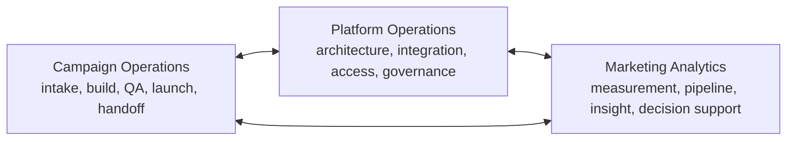

# Modern Marketing Operations Operating Model

> **Evidence classification:** Original portfolio framework synthesising team-design, platform, campaign and analytics leadership experience.

## Purpose

Marketing Operations becomes strategic when it owns the operating conditions through which Marketing can create trusted commercial outcomes.

It is not strategic merely because it attends senior meetings.

## Three connected capabilities

## Mission

> Create the process, platform, data and decision infrastructure that allows Marketing to execute reliably, prove contribution and improve without creating permanent operational dependency.

## Service model

| Service family | Example outputs |
|---|---|
| Commercial architecture | Lifecycle, routing, attribution, handoffs |
| Campaign operations | Intake, templates, QA, release and measurement |
| Platform stewardship | Roadmap, integration, access, data and vendor governance |
| Analytics | Funnel, pipeline, performance and executive decision support |
| Portfolio management | Prioritisation, capacity, dependencies and status |
| Enablement | Operating documentation, training and adoption |
| Improvement | Root-cause analysis, automation and operating-debt reduction |

## Decision rights

MOPS should own or co-own:

- Marketing-process standards
- Tier-one martech governance
- Campaign taxonomy and data requirements
- Lifecycle implementation quality
- Marketing data definitions
- Release controls
- Operational intake and prioritisation
- Measurement integrity

MOPS should not unilaterally own:

- Commercial strategy
- Sales acceptance criteria
- Finance definitions
- Customer-success policy
- Privacy interpretation
- Business outcomes outside its control

## Intake and prioritisation

Requests should be evaluated against:

1. Commercial impact
2. Risk reduction
3. Strategic alignment
4. Regulatory or customer obligation
5. Dependency removal
6. Effort and capacity
7. Reusability
8. Adoption readiness

## Distributed delivery

Repeatable production may be distributed. Senior judgement, architecture, exceptions and accountability remain named.

The test is not whether work was completed offshore or by a partner. The test is whether quality, learning and ownership remained inside the operating model.

## Maturity progression

| Stage | Behaviour |
|---|---|
| Service desk | Work arrives through relationships and urgency |
| Managed service | Intake, SLAs and standards exist |
| Platform owner | Architecture and governance are explicit |
| Commercial partner | Work is prioritised against business decisions |
| Operating-system function | Process, data, systems and measurement are managed as one portfolio |
