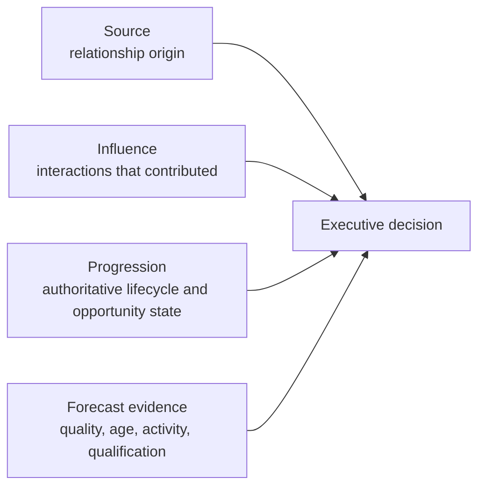

# Pipeline Truth

> **Evidence classification:** Original portfolio framework synthesising attribution, reporting and forecast-governance experience.

## Executive summary

Pipeline truth is not one attribution model. It is the ability to reconcile four separate questions:

1. Where did the relationship begin?
2. Which interactions influenced progression?
3. What commercial state is authoritative now?
4. How confident should leadership be in the expected outcome?

Combining those questions into one field creates political reporting rather than decision evidence.

## Evidence model

## Truth layers

| Layer | Purpose | Typical failure |
|---|---|---|
| Source | Identify the recognised origin | Source is overwritten by later activity |
| Influence | Show meaningful contribution | Every touch is treated as equal influence |
| Progression | Record current commercial state | Lifecycle and opportunity states disagree |
| Forecast | Assess expected outcome | Confidence is based on rep opinion alone |
| Reconciliation | Explain differences | Teams use different filters and populations |

## Minimum controls

- A documented source hierarchy
- A separate influence definition
- A canonical opportunity population
- Stage and close-date quality tests
- Clear treatment of reopened and recycled records
- Reconciliation between operational and executive reports
- A published definition for every headline metric
- Named ownership for corrections and exceptions

## Forecast confidence dimensions

A forecast-confidence model should consider:

- Qualification evidence
- Stakeholder coverage
- Recent verified activity
- Stage age
- Close-date movement
- Commercial next step
- Data completeness
- Historical stage behaviour
- Known exceptions

No score should replace the accountable forecast owner. It should expose where confidence is unsupported.

## Executive reporting contract

Every executive metric should disclose:

- Definition
- Population
- Time window
- System of record
- Refresh cadence
- Known exclusions
- Reconciliation method
- Owner
- Last review date

## Outcome

The goal is not a report everyone likes. It is a report that can be challenged, reconciled and defended without changing its definition depending on the audience.
