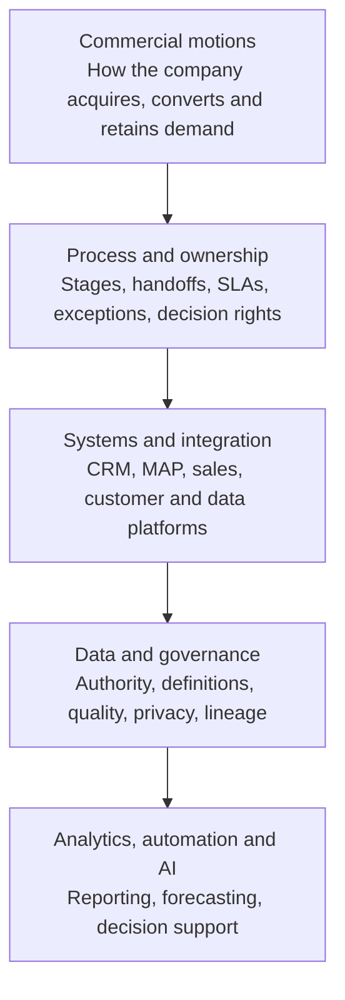

# Revenue Operating System

> **Evidence classification:** Original portfolio framework synthesising repeated operator experience.

## Executive summary

A revenue operating system connects the commercial model to the rules, systems and evidence required to run it.

It is broader than CRM design. A CRM can store the process, but it cannot resolve unclear ownership, contradictory definitions or a weak decision cadence.

## Five-layer model

The dependency runs downward. Analytics and AI cannot compensate for a weak ownership or data layer.

## Diagnostic questions

### Commercial motions

- Which motions are active: inbound, outbound, partner, product-led, expansion?
- Do they require different qualification, routing or service levels?
- Where does revenue responsibility change hands?

### Process and ownership

- What must be true for a record to enter or leave each stage?
- Who owns the record, the decision and the exception?
- Which transitions require acceptance rather than automatic progression?

### Systems

- Which system is authoritative for each decision?
- Where do integrations transform, overwrite or delay critical data?
- Which manual work exists because the process is unclear rather than because automation is missing?

### Data

- Are definitions consistent across functions?
- Can every executive metric be traced to an authoritative record?
- Which fields drive money, ownership or customer treatment?

### Analytics, automation and AI

- Which decisions are deterministic?
- Which require judgement?
- What evidence must remain visible?
- What must never execute without human approval?

## Operating record

Every material rule should be expressed as one current operating record:

| Element | Question |
|---|---|
| Purpose | What business decision does this rule support? |
| Owner | Who is accountable? |
| Authoritative system | Where is the current state recorded? |
| Decision rule | What conditions determine the outcome? |
| Approved exceptions | What may override the rule? |
| Required approval | Who can authorise the exception? |
| Review date | When will the rule be challenged again? |

## Maturity model

| Level | Description |
|---|---|
| 1. Fragmented | Teams use local definitions, spreadsheets and manual workarounds |
| 2. Documented | Processes exist but adoption and system enforcement are inconsistent |
| 3. Governed | Ownership, rules, exceptions and authoritative data are explicit |
| 4. Measured | Quality, velocity, adoption and decision outcomes are monitored |
| 5. AI-ready | Structured evidence supports governed automation and decision assistance |

## Implementation sequence

1. Map commercial motions and decisions.
2. Establish lifecycle and authority.
3. Resolve handoffs, SLAs and exceptions.
4. Define system and data authority.
5. Repair the minimum critical data set.
6. Build reporting and operating cadence.
7. Automate stable decisions.
8. Add AI only where evidence and accountability remain inspectable.

## Limitation

The framework does not determine the correct commercial strategy. It tests whether the organisation has built an operating system capable of executing the chosen strategy.
