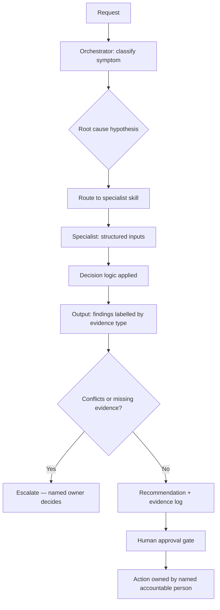

# Skills Library

Structured operator tooling — diagnostic logic, evidence standards and accountability boundaries encoded so that judgement is applied consistently rather than re-derived each time.

---

## What these are, and what they are not

These are not prompts. A prompt produces an answer. These encode a **decision sequence**: what evidence is required before a conclusion is permitted, how fact is separated from inference, where a human must approve, and what must never be automated.

The reusable asset is the diagnostic sequence, not the output. Every organisation's GTM system is idiosyncratic; what transfers between them is the ability to locate the real fault quickly. That is the thesis these skills exist to test — see `../OPERATOR-THESIS.md`, point 7.

## Design standards

Every skill in this library:

- takes **structured, portfolio-safe inputs** — schema, definitions and aggregate profile, never customer or prospect records
- **separates fact, assumption, inference, missing evidence and conflicting evidence** in its output
- names a **human owner** for every decision, and states what cannot be automated
- **escalates conflicts** rather than silently selecting a winner
- states its **limitations and failure modes**, including automation bias
- uses **fully synthetic examples** — fictional companies, fictional roles, invented data

No employer configuration, field architecture, prompt library or internal logic is reproduced anywhere in this library.

## Architecture

The orchestrator classifies the presenting symptom against likely root cause before selecting a skill. This ordering is deliberate: pattern-matching on topic routes to the wrong tool, because the topic a stakeholder raises is usually the symptom, not the fault.

---

## Catalogue

### Reported by Claude audit — source verification pending

| Skill | Role | Evidence classification |
|---|---|---|
| **GTM Revenue Architect** | Reported orchestration layer with strategic / execution routing, frameworks, workflows and a symptom-to-root-cause diagnostic table | Candidate original operator framework over applied third-party methodology; source verification required |
| **Revenue Execution and Enablement Engine** | Reported deal qualification and coaching system using evidence-first scoring | Candidate original operating discipline applied to MEDDICC / SPICED; source verification required |
| **Clay GTM Skill Pack** | Reported enrichment and data-pipeline design with specialist modules | Applied platform expertise; source verification required |

*B2B Demand & Revenue Architect* was also reported as inspected by Claude. It substantially overlaps GTM Revenue Architect and appears to be a superseded generation; one should be represented, not both.

### Architecture evidenced — individual artefacts pending

Fourteen specialist skills are named in the portfolio architecture: Lifecycle Control Tower, Reporting Truth Validator, Event Pipeline Converter, Seller Behavior Auditor, CRM Data Quality Auditor, Interaction Signal Designer, MAP Architecture Designer, Marketing SLA Engine, Email Deliverability Auditor, Channel Signal Auditor, Campaign Blueprint, MOPS Operating System, Decision Validator and MOPS Leader.

The architecture is evidenced at a high level, but individual source artefacts have not been imported or independently verified in this repository. They are not published here as built tooling. Each will be specified in full once Christopher confirms which exist; design-intent modules will be labelled **Concept under development** and held in `../ROADMAP.md`.

One fully worked specification — [`crm-data-quality-auditor/`](crm-data-quality-auditor/) — is included as the **format exemplar** and is explicitly labelled as a draft pending verification.

---

## Provenance note

Several constructs referenced inside the reported skills — including the Demand Unit Waterfall, Programme Pendulum, Achievability Index, Cooperation Index and Demand Management Council — are **SiriusDecisions / Forrester methodology**, applied by a certified practitioner. They are not original creations and are not presented as such.

Originality may be claimed only for independently evidenced orchestration, diagnostic sequencing, evidence classification, operating adaptation and human-accountability boundaries. Full discussion is in [`../SKILLS-AND-SYSTEMS.md`](../SKILLS-AND-SYSTEMS.md).
