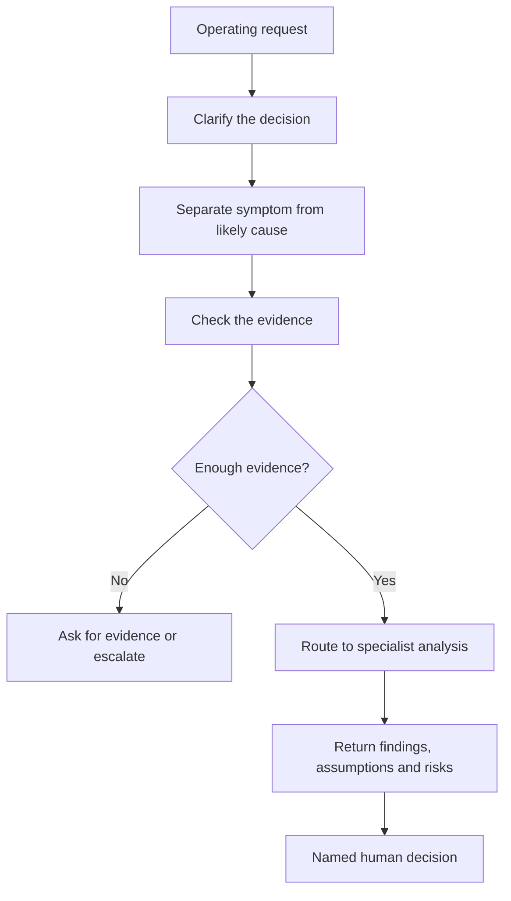

# Skills Library

This library is where I turn operating judgement into clear, repeatable logic.

These are not prompt collections. Each skill should make the decision sequence visible: what evidence is needed, how facts are separated from assumptions, where a human must decide and what should never be automated.

## What I am trying to prove

Every company is different, so I do not believe one fixed answer travels well. What can travel is the diagnostic sequence: the questions that expose the real fault, the evidence required before acting and the controls that stop a recommendation becoming an unaccountable decision.

That is the asset I am testing here.

## Standards I apply

Every skill in this library should:

- Take structured, portfolio-safe inputs
- Use fictional examples and synthetic data
- Separate facts, assumptions, inferences, missing evidence and conflicts
- Name the human owner of the decision
- Escalate unresolved ownership or definition problems
- State what it cannot safely automate
- Explain its failure modes and limitations
- Produce an output that can be inspected, challenged and improved

I do not reproduce company configurations, private schemas, internal prompt libraries or live data.

## Architecture

The order is deliberate. A stakeholder usually presents the topic, not the root cause. Routing directly from topic to answer creates polished but shallow output.

## What is available now

### [GTM Command Center](command-center/README.md)

A reconstructed orchestration model showing how I classify the decision, check evidence, route analysis and preserve human accountability.

### [CRM Data Quality Auditor](crm-data-quality-auditor/README.md)

A detailed draft specification used to show the standard expected for individual skills. It is not presented as verified historical tooling.

## Historical skill material still under review

A previous Claude audit identified several larger skill packages, including:

- GTM Revenue Architect
- Revenue Execution and Enablement Engine
- B2B Demand and Revenue Architect
- Clay GTM Skill Pack

I have not presented these as finished assets because the approved source material is not yet in this repository. Two of the revenue-architecture packages may also be different generations of the same work.

The correct next step is verification, not generating more pages from the names.

## Named specialist architecture

The wider Command Center architecture includes specialist areas for lifecycle, reporting truth, event conversion, seller behaviour, CRM data quality, interaction signals, marketing automation, SLAs, deliverability, channel signals, campaign design, MOPS operating models, decision validation and leadership prioritisation.

The architecture is represented. The historical implementation status of each specialist is still being checked.

## Third-party methodology

Some methods referenced in the historical skills come from established Forrester, SiriusDecisions, MEDDICC and SPICED frameworks.

I use and adapt those methods where relevant, but I do not claim the underlying methodology as my own. The original contribution, where evidenced, sits in the orchestration, diagnostic sequence, evidence rules and accountability boundaries.

## The standard going forward

A smaller library of credible, well-specified skills is more useful than a large collection of generated descriptions.

See [Skills and Systems](../SKILLS-AND-SYSTEMS.md) and the [Verification Backlog](../evidence/verification-backlog.md).