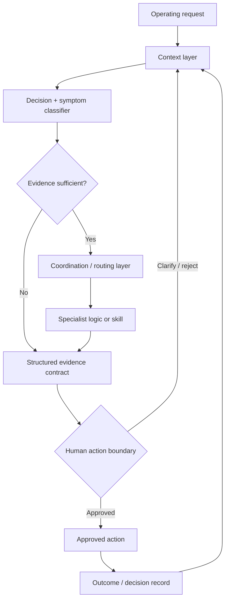

# GTM Command Center

> **Evidence classification:** Portfolio-safe architecture reconstruction. It demonstrates the orchestration and control pattern; it is not a claim that this exact repository architecture ran inside a former employer environment.

## Executive summary

The GTM Command Center is an operating-control pattern for AI-assisted Revenue and Marketing Operations.

It takes a broad commercial symptom, identifies the decision that actually needs to be made, checks whether the evidence is good enough, routes the request to a narrow specialist, separates facts from assumptions, and preserves a named human decision owner.

The objective is not “one AI that knows GTM.” The objective is a system that is **legible, modular, testable and difficult to bluff**.

For the wider operating model, see [AI GTM Operations](../../AI-GTM-OPS.md).

## Control-plane architecture

## Layer 1 — Context

The durable context is the operating system the business has agreed to run.

Examples:

- Lifecycle and funnel definitions
- Qualification rules
- Routing and territory logic
- Ownership and handoff standards
- SLA definitions
- Attribution and forecast definitions
- CRM / MAP field authority
- Campaign readiness rules
- Decision rights and escalation paths

Context should be versioned when it is policy-like. Time-sensitive operational data should remain in the authoritative live system and be retrieved when needed rather than copied into static documentation.

## Layer 2 — Coordination

The coordination layer determines which operating problem is actually present.

A stakeholder may say:

- “Pipeline is weak”
- “Leads are being ignored”
- “The dashboard is wrong”
- “Event follow-up is poor”
- “We need an AI SDR”

Those are symptoms, not routes.

The coordination layer should decide whether the request belongs with lifecycle governance, routing/SLA, pipeline truth, CRM data quality, campaign operations, AI workflow design or decision clarification.

A synthetic version of this layer is implemented in the [GTM Ops Decision Router](../../tools/gtm-ops-router/README.md).

## Layer 3 — Specialist logic

Specialists are deliberately narrow. Each should have a clear input contract, evidence requirement, output contract and failure mode.

The architecture includes areas such as:

- Lifecycle governance
- Reporting and pipeline truth
- Event conversion
- Seller behaviour
- CRM data quality
- Interaction signals
- Marketing automation architecture
- SLA governance
- Deliverability
- Channel signals
- Campaign design
- MOPS operating model
- Decision validation
- Leadership prioritisation

Individual historical implementations are not presented as verified solely because their names appear in the architecture.

## Layer 4 — Evidence contract

Every specialist output should separate:

- **Facts** — directly supported by authoritative evidence
- **Assumptions** — supplied or necessary assumptions
- **Inferences** — conclusions drawn from facts
- **Missing evidence** — information required before stronger action
- **Conflicting evidence** — sources that disagree
- **Recommendation** — proposed next step
- **Decision owner** — person accountable for the material decision
- **Risk / reversibility** — consequence if the recommendation is wrong

This contract matters because an AI-generated paragraph can sound confident even when the evidence is weak.

## Layer 5 — Action boundary

The Command Center can structure analysis, validate rules, identify gaps and prepare recommendations.

It should not autonomously make high-impact changes such as:

- Bulk modification of production CRM data
- Changes to customer or prospect treatment
- Reassignment of commercial ownership policy
- Approval of spend
- Definition of executive metrics or forecasts
- Staffing or territory decisions
- Compliance-sensitive treatment

The approval boundary should reflect impact, reversibility, evidence quality and policy.

## Layer 6 — Outcome and learning record

A useful system should retain what was recommended, what decision was taken and what happened next.

That allows future analysis to distinguish between:

- A recommendation that worked
- A recommendation that was rejected
- A recommendation that failed because the evidence was wrong
- A recommendation that failed because the operating policy changed

Learning should not silently rewrite business rules. Material context, prompt or routing changes should be versioned and reviewable.

## Input contract

A well-formed request should provide as much of the following as possible:

- Decision to be made
- Business context
- Known symptom
- Authoritative sources
- Available evidence
- Constraints
- Named accountable owner
- Deadline / decision horizon
- Action boundary

Missing fields are not automatically fatal, but they should affect how far the system is allowed to proceed.

## Routing principles

1. Identify the decision, not only the topic.
2. Separate the symptom from likely root-cause categories.
3. Use the narrowest specialist that fits the evidence.
4. Preserve ambiguity when two routes are equally plausible.
5. Retrieve live data from its authoritative system rather than treating static context as a database.
6. Keep business logic portable enough to survive tool changes.
7. Require a human decision when ownership, policy or evidence is unresolved.
8. Log material recommendations and outcomes so the operating system can improve without silently changing itself.

## Synthetic example

**Request:** “Event pipeline is weak.”

The orchestrator should not immediately write a follow-up sequence.

It first asks:

- Is attendance data complete?
- Is the commercial objective defined?
- Are qualification and ownership rules explicit?
- Was the receiving team required to accept the handoff?
- Are follow-up SLAs measured?
- Is pipeline being assessed using source, influence or progression?
- Is the issue really event conversion, or a reporting-definition problem?

Depending on the evidence, the request might route to Campaign Operations, Routing & SLA, Lifecycle Governance or Pipeline Truth.

## Evaluation questions

I would judge the system on more than answer quality.

| Control | Question |
|---|---|
| **Routing** | Did the request reach the correct operating specialist? |
| **Evidence** | Can every material claim be traced to an authoritative source or explicit inference? |
| **Abstention** | Did the system stop when evidence or ownership was insufficient? |
| **Consistency** | Do repeated requests apply the same operating definitions? |
| **Action safety** | Was the human approval boundary respected? |
| **Change control** | Are material changes to context and logic versioned? |
| **Outcome learning** | Can the next run see what was recommended and what happened? |

## Portfolio proof

The repository currently demonstrates different parts of the architecture through:

- [GTM Ops Decision Router](../../tools/gtm-ops-router/README.md) — coordination and evidence gating
- [Pipeline Quality Scanner](../../tools/pipeline-quality-scanner/README.md) — inspectable pipeline-quality rules
- [Lifecycle Transition Validator](../../tools/lifecycle-validator/README.md) — lifecycle policy represented as executable logic
- [Runnable Tools](../../tools/README.md) — unit-tested synthetic demonstrations

## Productisation hypothesis

The durable asset is not a single generated answer or a single AI vendor.

It is the combination of **trusted context + decision routing + specialist logic + evidence contracts + human controls + outcome learning**.

That operating layer can then connect to whichever execution tools are appropriate without rebuilding the commercial brain every time the software market changes.
