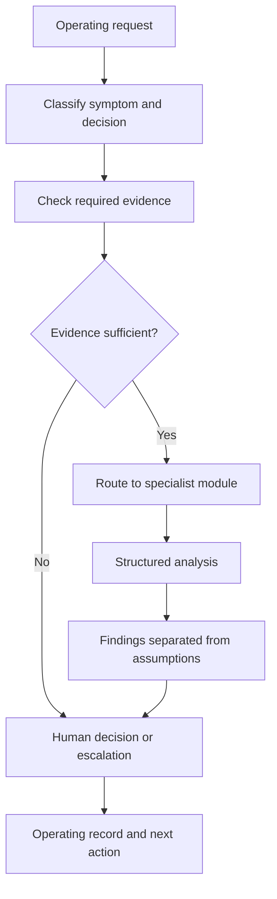

# GTM Command Center

> **Evidence classification:** Architecture evidenced at a high level; portfolio-safe reconstruction. Individual historical modules remain subject to source verification.

## Executive summary

The GTM Command Center is an orchestration pattern for routing operating problems to the right specialist analysis while preserving evidence, uncertainty and human accountability.

It is not a chatbot that answers every GTM question. Its primary value is refusing to treat the presenting topic as the root cause.

## Business problem

A stakeholder raises a symptom:

- Pipeline is weak
- Routing is broken
- The dashboard is wrong
- Event follow-up is poor
- The MAP is not working
- CRM data is incomplete

A generic assistant responds to the topic. An operator first determines which underlying decision, ownership, process or data failure could produce the symptom.

## Architecture

## Specialist catalogue

The high-level architecture includes modules for:

- Lifecycle governance
- Reporting truth
- Event conversion
- Seller behaviour
- CRM data quality
- Interaction signals
- Marketing automation architecture
- SLAs
- Deliverability
- Channel signals
- Campaign design
- MOPS operating model
- Decision validation
- Leadership prioritisation

Individual historical implementations are not presented as verified solely because their names appear in the architecture.

## Input contract

A request should provide:

- Decision to be made
- Business context
- Known symptoms
- Authoritative sources
- Available evidence
- Constraints
- Named accountable owner
- Required deadline

## Routing logic

1. Identify the decision, not only the topic.
2. Separate symptom from likely root-cause categories.
3. Determine whether evidence is sufficient.
4. Route to the narrowest appropriate specialist.
5. Preserve conflicting evidence.
6. Require escalation where ownership or definitions are unresolved.
7. Return an operating record rather than only narrative advice.

## Output contract

Every output separates:

- Facts
- Assumptions
- Inferences
- Missing evidence
- Conflicting evidence
- Recommendations
- Required human decisions
- Risks and limitations

## Human accountability

The Command Center may structure analysis, identify gaps and recommend next actions.

It must not autonomously:

- Change production data
- Approve spend
- Alter customer treatment
- Assign commercial ownership
- Override policy
- Make staffing decisions
- Publish an executive metric
- Resolve a stakeholder dispute without an accountable owner

## Synthetic example

**Request:** “Event pipeline is weak.”

The orchestrator does not immediately generate a follow-up sequence. It asks:

- Is attendance data complete?
- Is the commercial objective defined?
- Are qualification and ownership rules explicit?
- Was the receiving team required to accept the handoff?
- Are follow-up SLAs measured?
- Is pipeline being assessed using source or influence?

Depending on the evidence, the request may route to Event Pipeline Converter, Marketing SLA Engine, Lifecycle Control Tower or Reporting Truth Validator.

## Productisation hypothesis

The transferable asset is not the generated answer. It is the diagnostic routing, evidence standard and accountability contract.

That hypothesis remains to be tested through synthetic demonstrations and reviewer feedback.
