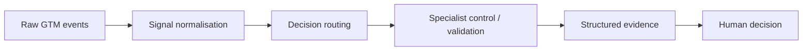

# Runnable Proof

This collection contains small, inspectable tools that demonstrate GTM operating logic using synthetic data.

They are intentionally transparent. The goal is to make rules, evidence requirements and control boundaries visible enough to test and challenge — not to pretend a portfolio script is a production revenue platform.

Every change under `tools/` is validated in GitHub Actions against Python 3.12. The CI matrix runs the unit-test suite for each demonstration independently so a broken tool does not hide behind documentation claims.

## Tools

| Tool | What it demonstrates |
|---|---|
| [GTM Signal Normalizer](gtm-signal-normalizer/README.md) | CRM / MAP / product event contracts, source provenance, deduplication and event-driven GTM architecture |
| [GTM Ops Decision Router](gtm-ops-router/README.md) | Coordination-layer routing, evidence gates, ambiguity handling and human approval boundaries |
| [Pipeline Quality Scanner](pipeline-quality-scanner/README.md) | Explicit data-quality rules that affect pipeline and reporting trust |
| [Lifecycle Transition Validator](lifecycle-validator/README.md) | Lifecycle movements tested against explicit governance rules |

All four tools:

- Use Python's standard library only
- Operate on fictional / synthetic data
- Keep decision logic inspectable
- Produce structured outputs
- Include unit tests
- Run in GitHub Actions
- Preserve explicit human or governance boundaries
- Contain no employer configuration, customer information or production credentials

## What the collection demonstrates together

The collection is intentionally not a fake production platform. It shows four technical capabilities that increasingly matter in AI-native GTM Operations:

1. **Integration contracts** — define what signals mean before downstream systems use them
2. **Coordination** — route broad operating requests to the correct decision path
3. **Explicit controls** — express pipeline and lifecycle governance as inspectable logic
4. **Testability** — keep operating rules version-controlled and executable

## Why code belongs in this portfolio

Most senior MOPS and RevOps work is not software engineering. But increasingly, GTM leaders need to be able to express operating logic precisely enough for automation, agents and technical teams to implement it safely.

These tools show the bridge between an operating rule and something executable:

**business definition → explicit rule → test → structured output → human decision**

For the wider architecture, see [AI GTM Operations](../AI-GTM-OPS.md) and the [GTM Command Center](../skills/command-center/README.md).
