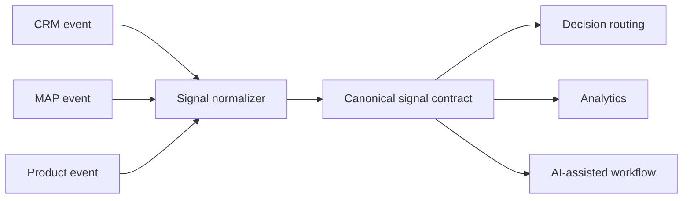

# GTM Signal Normalizer

> **Evidence classification:** Synthetic portfolio demonstration. It emulates event intake using local JSON; it does not connect to employer systems or make network calls.

## Business problem

AI-native GTM workflows depend on signals moving cleanly between CRM, marketing automation, product and analytics systems.

The difficult part is rarely “can we send a webhook?” The difficult part is deciding what an event means, which source is authoritative, whether it is safe to deduplicate, and what contract downstream workflows should be allowed to depend on.

This tool demonstrates that translation layer.

## Architecture



In a production architecture, the source events could arrive through APIs, webhooks, event streams or warehouse pipelines. The public demo deliberately replaces those connections with synthetic local JSON so the logic remains safe and inspectable.

## Supported synthetic source events

| Source | Example event | Canonical signal |
|---|---|---|
| CRM | `opportunity_stage_changed` | `pipeline_stage_change` |
| CRM | `owner_changed` | `ownership_change` |
| Marketing automation | `form_submitted` | `intent_form_submission` |
| Marketing automation | `event_attended` | `event_attendance` |
| Marketing automation | `email_clicked` | `email_engagement` |
| Product | `trial_started` | `product_trial_started` |
| Product | `usage_threshold_reached` | `product_usage_threshold` |

The mappings are fictional examples. A real GTM organisation would approve its own source authority and semantic mapping.

## Canonical signal contract

Accepted events are normalised into a small common shape:

```json
{
  "signal_id": "sig_<deterministic-id>",
  "entity_id": "account-2001",
  "signal_type": "product_usage_threshold",
  "occurred_at": "2026-08-20T10:30:00Z",
  "source_system": "product",
  "source_event_id": "evt-002",
  "payload": {
    "threshold": "synthetic_high_usage"
  }
}
```

The contract deliberately keeps **source provenance** alongside the canonical signal. Normalisation should not make it impossible to trace where the evidence came from.

## Controls demonstrated

### Required-field validation

Events missing source, type, entity, ID or timestamp are rejected rather than partially interpreted.

### Explicit event mapping

Unknown source systems and unknown event types are rejected. The system does not invent a semantic meaning for an event it does not understand.

### Timezone-aware timestamps

Naive timestamps are rejected because sequence and SLA analysis become unreliable when time context is ambiguous.

### Idempotency / duplicate handling

A duplicate `source_system + event_id` pair is ignored after the first accepted event. In a production system, the precise idempotency contract would need to reflect source-system guarantees and replay behaviour.

### Deterministic signal IDs

A source event maps to a stable synthetic signal identifier, making repeated processing inspectable.

### Schema-change governance

The output explicitly states that schema or mapping changes require human review. A new field or event should not silently redefine GTM meaning downstream.

## Run

Requires Python 3.11+ and only the standard library.

```bash
python normalizer.py sample_events.json
```

Run the tests:

```bash
python -m unittest
```

The repository's GitHub Actions matrix runs this test suite with the other runnable demonstrations whenever `tools/` changes.

## Output contract

The result reports accepted, rejected and duplicate events separately, followed by the normalised signals and explicit rejection reasons.

Example shape:

```json
{
  "events_received": 5,
  "signals_accepted": 3,
  "events_rejected": 1,
  "duplicates_ignored": 1,
  "human_review_required_for_schema_or_mapping_changes": true
}
```

The included synthetic sample file is the source of truth for an actual run.

## Why this matters for AI GTM Operations

A model should not have to reverse-engineer the meaning of every raw event from every tool on every request.

A controlled signal layer can provide:

- Stable event semantics
- Traceable source evidence
- Explicit entity identity
- Clean timestamps
- Duplicate handling
- A version-controlled mapping contract

That gives downstream routing, scoring, analytics and AI-assisted workflows a stronger operating foundation.

## What this demonstrates

- Systems integration thinking across CRM, MAP and product signals
- API / webhook / event-contract concepts without exposing production integrations
- JSON data contracts
- Idempotency and source provenance
- Version-controlled GTM signal semantics
- A technical bridge between RevOps architecture and AI-assisted workflows

## What it does not prove

- Production API or webhook deployment
- A complete event-bus implementation
- Employer source-system configuration
- Real customer or product telemetry
- That every GTM event belongs in one central schema

## Related portfolio evidence

- [AI GTM Operations](../../AI-GTM-OPS.md)
- [GTM Command Center](../../skills/command-center/README.md)
- [GTM Ops Decision Router](../gtm-ops-router/README.md)
- [Pipeline Quality Scanner](../pipeline-quality-scanner/README.md)
- [Lifecycle Transition Validator](../lifecycle-validator/README.md)
