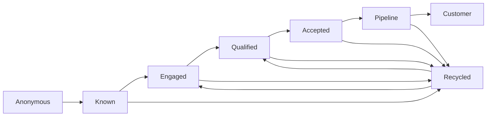

# Lifecycle Transition Validator

> **Evidence classification:** Synthetic portfolio demonstration. This is not employer production code or a copy of an employer lifecycle.

## Business problem

A lifecycle only becomes useful when its stage meanings, permitted movements, ownership and exception handling are explicit.

Many GTM organisations have stage labels in CRM or MAP but still rely on individual judgement to decide when records can move, who owns the transition, or why something was recycled. That makes routing, SLA measurement, reporting and automation progressively harder to trust.

This tool demonstrates lifecycle governance as visible, testable rules.

## Demonstration lifecycle



The stages are fictional and intentionally generic. A real organisation would define and approve its own lifecycle before encoding it.

## What it checks

| Rule | Why it matters |
|---|---|
| Missing required fields | A governed transition needs enough information to be reviewed |
| Unknown stages | Unrecognised stage values break consistent lifecycle reporting |
| Invalid stage transitions | Prevents stage skipping or movements outside the agreed operating model |
| Missing owner | Every material transition needs accountability |
| Recycling without a reason | Recycling without a reason hides why demand left the active funnel and weakens learning |

## Run

Requires Python 3.11+ and only the standard library.

```bash
python validator.py sample_transitions.csv
```

Run the tests:

```bash
python -m unittest
```

The repository's GitHub Actions matrix runs the tool's unit tests whenever `tools/` changes.

## Output contract

The validator returns structured JSON containing the records scanned, findings by rule and severity, record-level findings, and an explicit human-approval flag.

Example shape:

```json
{
  "records_scanned": 7,
  "findings_count": 3,
  "findings_by_rule": {
    "invalid_transition": 1,
    "missing_owner": 1,
    "missing_recycle_reason": 1
  },
  "human_approval_required": true
}
```

Counts above illustrate the output contract; the included sample file is the source of truth for an actual run.

## Governance principle

The central design choice is that `ALLOWED_TRANSITIONS` is visible in code.

That means a reviewer can ask:

- Who approved this transition?
- Why can Recycled return to Qualified?
- Should Pipeline ever move backwards directly?
- Which transition requires Sales acceptance?
- Which exceptions should be warnings rather than hard failures?

The tool does not hide those decisions in an opaque automation layer.

## Human accountability

The validator supports governance; it does not define the lifecycle for the business.

A Marketing Operations or Revenue Operations owner should approve the lifecycle semantics, transition policy and remediation path before any rule is implemented in production systems.

It therefore detects policy violations but never changes a record automatically.

## What this demonstrates

- Translating lifecycle policy into executable rules
- Explicit ownership and exception handling
- A governance model that can be inspected by business and technical reviewers
- Unit-testable operating logic
- A reusable pattern for safer automation and AI-assisted operations

## What it does not prove

- That this fictional lifecycle should be used by a real company
- Production deployment
- Autonomous lead-management decisions
- Access to employer lifecycle definitions or CRM configuration

## Data boundary

The sample file is fictional and contains no customer, prospect, employee or production data.

## Related portfolio evidence

- [Lifecycle Governance](../../frameworks/lifecycle-governance.md)
- [Unified Lifecycle Governance case](../../case-studies/flagship/unified-lifecycle-governance.md)
- [AI GTM Operations](../../AI-GTM-OPS.md)
- [GTM Ops Decision Router](../gtm-ops-router/README.md)
